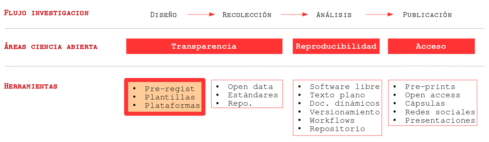
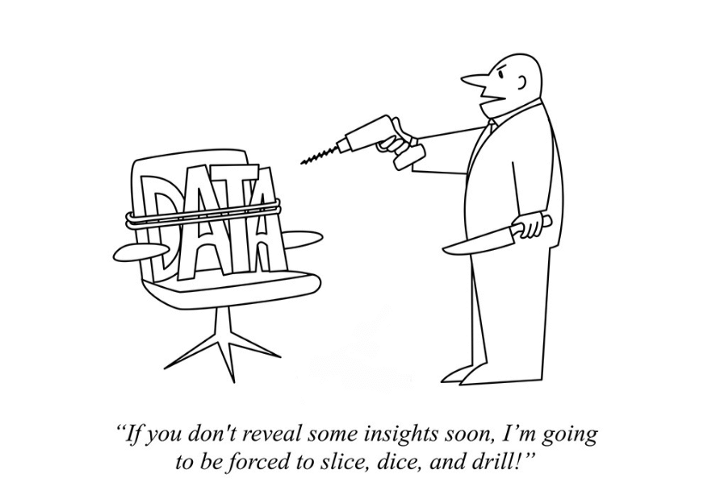
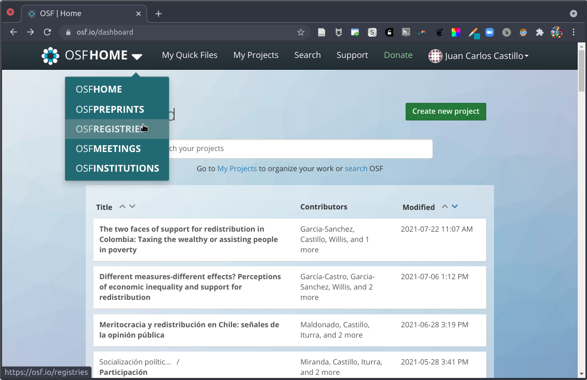
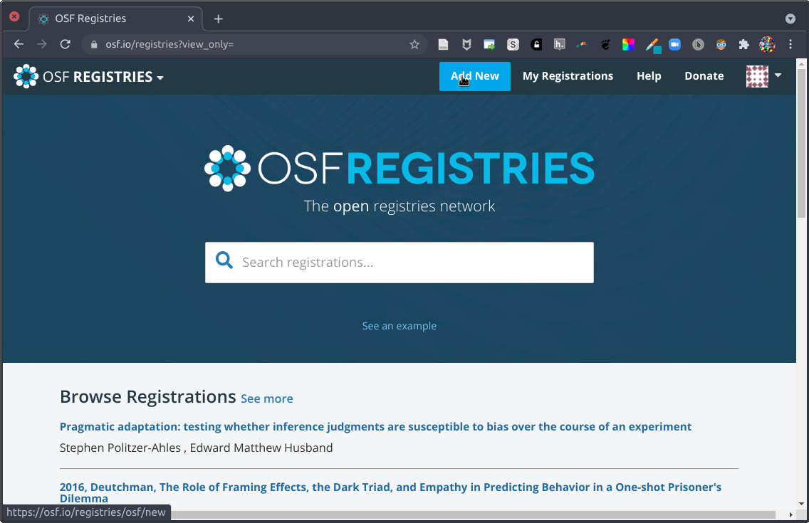
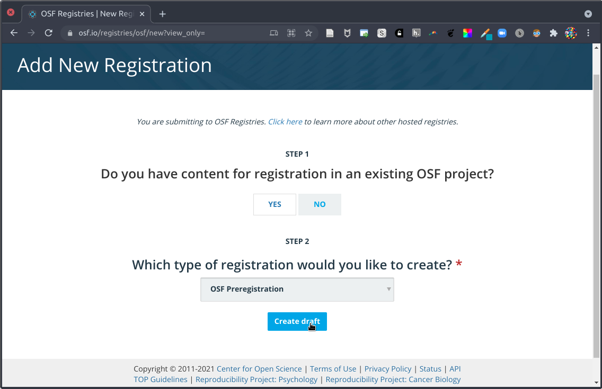

class: front

```{r eval=FALSE, include=FALSE}
# Correr esto para que funcione el infinite moonreader, el root folder debe ser static para si dirigir solo "bajando" en directorios hacia el bib y otros

1) set slides como working directory, y luego desde consola
xaringan::inf_mr('03-preregistro-OSF/03_preregistro_osf.Rmd') # correr desde TERMINAL, en R & ATOM!!


```


```{r setup, include=FALSE, cache = FALSE}
require("knitr")
options(htmltools.dir.version = FALSE)
pacman::p_load(RefManageR)
# bib <- ReadBib("../../bib/electivomultinivel.bib", check = FALSE)
opts_chunk$set(warning=FALSE,
             message=FALSE,
             echo=FALSE,
             cache = FALSE, fig.width=7, fig.height=5.2)
pacman::p_load(flipbookr, tidyverse)
```


```{r xaringanExtra, include=FALSE}
xaringanExtra::use_xaringan_extra(c("tile_view", "animate_css"))
# xaringanExtra::use_share_again()
xaringanExtra::use_scribble()
```


<!---
Para correr en ATOM
- open terminal, abrir R (simplemente, R y enter)
- rmarkdown::render('static/docpres/07_interacciones/7interacciones.Rmd', 'xaringan::moon_reader')

About macros.js: permite escalar las imágenes como [scale 50%](path to image), hay si que grabar ese archivo js en el directorio.
--->


.pull-left[
# Ciencia Social Abierta
## Juan Carlos Castillo
## Sociología FACSO - UChile
## 2do Sem 2021
## [.orange[cienciasocialabierta.netlify.app]](https://cienciasocialabierta.netlify.app)
]


.pull-right[
.right[
<br>
## .orange[Sesión 3: Preregistros & OSF]


]

]
---

layout: true
class: animated, fadeIn

---
class: roja, middle, right

## 1. Resumen sesión anterior
## 2. Reportes y exploración
## 3. Preregistros
## 4. Plantillas y OSF (Open Science Framework)

---
class: roja, middle, right


## 1. .yellow[Resumen sesión anterior]
## 2. Reportes y exploración
## 3. Preregistros
## 4. Plantillas y OSF (Open Science Framework)


---
## .orange[Resumen (I)]

- Crisis de acceso <-> crisis de reproducibilidad

- Publica (alto impacto) o perece -> fomento de la irreproducibilidad

- Escasa publicación de estudios con resultados nulos

- Dilemas de eficiencia y éticos

---
## .orange[Resumen (II): Enfrentando la crisis]

- Pre-registro de estudios

- Datos abiertos

- Análisis reproducible

- Publicación abierta y oportuna

---
class: roja, middle, right


## 1. Resumen sesión anterior
## 2. .yellow[Reportes y exploración]
## 3. Preregistros
## 4. Plantillas y OSF (Open Science Framework)


---
class: middle


---
- Angélica está investigando la relación entre género e ingresos. 

--

- No encuentra resultados esperados en base a su hipótesis (mujeres obtienen menores ingresos)

--

- Luego ajusta la variable ingresos de continua a categórica, y saca algunos outliers y obtiene una diferencia significativa con probabilidad de error p <0.05

--

- Luego elimina a mujeres menores a 30 años y con muy bajo nivel educacional, obtiene un p <0.01

--
.center[
# ¿Problema?
]

---

.center[

]

---
# Algunas (malas) prácticas

- presentar resultados exploratorios como si fueran guiados por teorías

  - **HARKing** (Hypothesizing After Results are Known)

- buscar/reportar selectivamente aquellos resultados que si calzan con las hipótesis

  - **p-hacking**
  
---
# Consecuencias

- el problema *no es la exploración de datos*, sino su uso en reporte selectivo de resultados de investigación

--

- incrementa la posibilidad de rechazar erróneamente $H_0$

--

- exageraciones de efectos estimados, perjudicando la replicabilidad

--

- se confirma lo que uno está buscando, no lo que entregan los datos (y pierde sentido el recolectar datos, y hacer investigación empírica)


---
class: roja, middle, right


## 1. Resumen sesión anterior
## 2. Reportes y exploración
## 3. .yellow[Preregistros]
## 4. Plantillas y OSF (Open Science Framework)

---
# Una solución: .orange[Pre-registro]

- se crea un registro permanente y disponible del plan del estudio .orange[antes de mirar los datos]

- fechado e inmodificable

- accesible fácilmente y con opción de resguardo de anonimato de autores

- objetivo principal:  diferenciar aspectos especificados a priori (hipótesis y análisis) de aquellos más exploratorios 

---
# Ventajas de Preregistros

.pull-left[
- transparencia

- eficiencia

- mantener el foco en la teoría

- .red[no impide explorar], solo diferenciar bien exploración de hipótesis
]

.pull-right[


]

---
# hombros de gigante vs conejos del sombrero

.center[
.pull-left[


]

.pull-right[


]
]

---
# Tipos de preregistro

- **Preregistro (sin revisión)**: simplemente detallar hipótesis, datos y análisis y registar en repositorio apropiado

--

- **Reporte registrado** (con revisión): 
  - se somete a revisión en revista que permita esta opción
  - de ser aceptado, se publicará independiente de sus resultados
  - permite lidiar con el sesgo de publicación 

--

- **Reporte preregistrado de replicación**: específico para estudios de replicas de investigación


---
class: roja, middle, right


## 1. Resumen sesión anterior
## 2. Reportes y exploración
## 3. Preregistros
## 4. .yellow[Plantillas y OSF (Open Science Framework)]

---
# Plantillas de pre-registro (templates)

- formato de pre-registro que especifica campos a completar con información necesaria

- distintas alternativas

- asociadas a plataformas y plantillas de publicación

- Más conocidas:

  - [https://aspredicted.org/](https://aspredicted.org/)
  - [Open Science Framework - OSF](https://osf.io/)

---
## Campos típicos e información apropiada

<iframe src="datacolada.png" 
            height="500" 
            width="400" 
            marginwidth="50" 
            scrolling="yes">
</iframe>

---
[](https://aspredicted.org/)

- desarrollado por el [Credibility Lab](https://credlab.wharton.upenn.edu/) de Wharton

- formulario simple y rápido en linea

- queda almacenado y disponible

---
class: middle

.pull-left-narrow[
<br>
<br>
<br>
[](https://osf.io/)

]

.pull-right-wide[

- entorno de apertura de proyectos de investigación completos (más allá de los pre-registros)

- se pueden pre-registrar estudios asociados a un proyecto ya generado en OSF, o de manera independiente

- disponibilidad de [múltiples plantillas de pre-registro](https://osf.io/zab38/wiki/home/)
]
---
.center[

]

---
.center[

]
---
.center[

]

---
class: roja

# .yellow[Resumen]

### - consecuencias de confundir exploración con hallazgos guiados por teoría

### - pre-registros: ventajas éticas y de eficiencia 

### - plantillas, campos y accesibilidad


---
# Referencias

- [How To Properly Preregister A Study](http://datacolada.org/64)

- [Lindsay et al (2016) Research Preregistration 101.](https://www.psychologicalscience.org/observer/research-preregistration-101)

- [Nosek, B. A., Ebersole, C. R., DeHaven, A. C., & Mellor, D. T. (2018). The preregistration revolution. Proceedings of the National Academy of Sciences, 115(11), 2600–2606. https://doi.org/10.1073/pnas.1708274114
](https://www.pnas.org/content/115/11/2600) 

- [OSF Preregistration resources](https://www.cos.io/initiatives/prereg)

- [How To Properly Preregister A Study - Data Colada](http://datacolada.org/64)


---
class: roja middle center
# Próxima clase

# .yellow[DATOS ABIERTOS]

---
class: front


.pull-left[
# Ciencia Social Abierta
## cienciasocialabierta.netlify.app
----
## Juan Carlos Castillo
## Sociología FACSO - UChile
## 2do Sem 2021
]


.pull-right[
.right[

]


]
