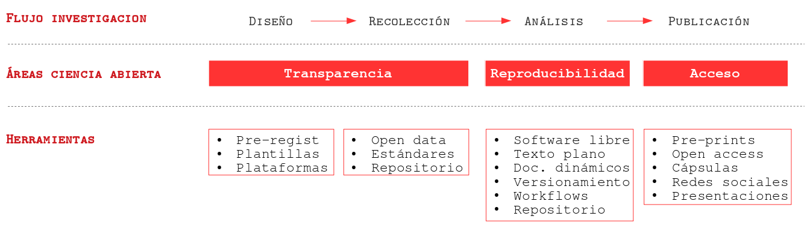
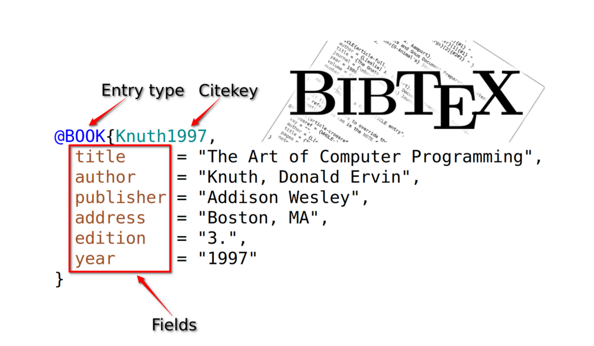
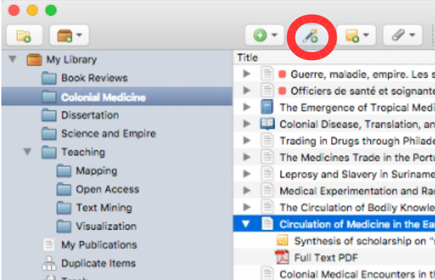

class: front

```{r eval=FALSE, include=FALSE}
# Correr esto para que funcione el infinite moonreader, el root folder debe ser static para si dirigir solo "bajando" en directorios hacia el bib y otros

1) set slides como working directory, y luego desde consola
xaringan::inf_mr('03-preregistro-OSF/03_preregistro_osf.Rmd') # correr desde TERMINAL, en R & ATOM!!


04-textoplano_bib/04_textoplano_bib.Rmd

```


```{r setup, include=FALSE, cache = FALSE}
require("knitr")
options(htmltools.dir.version = FALSE)
pacman::p_load(RefManageR)
# bib <- ReadBib("../../bib/electivomultinivel.bib", check = FALSE)
opts_chunk$set(warning=FALSE,
             message=FALSE,
             echo=FALSE,
             cache = FALSE, fig.width=7, fig.height=5.2)
pacman::p_load(flipbookr, tidyverse)
```


```{r xaringanExtra, include=FALSE}
xaringanExtra::use_xaringan_extra(c("tile_view", "animate_css"))
# xaringanExtra::use_share_again()
xaringanExtra::use_scribble()
```


<!---
Para correr en ATOM
- open terminal, abrir R (simplemente, R y enter)
- rmarkdown::render('static/docpres/07_interacciones/7interacciones.Rmd', 'xaringan::moon_reader')

About macros.js: permite escalar las imágenes como [scale 50%](path to image), hay si que grabar ese archivo js en el directorio.
--->


.pull-left[
# Ciencia Social Abierta
## Juan Carlos Castillo
## Sociología FACSO - UChile
## 2do Sem 2021
## [.orange[cienciasocialabierta.netlify.com]](https://cienciasocialabierta.netlify.com)
]


.pull-right[
.right[
<br>
### .white[_Unidad 2 - Reproducibilidad_] <br> .orange[Sesión 5: Texto plano & citas]


]

]
---

layout: true
class: animated, fadeIn

---
class: middle



---
class: middle, center


---
## Elementos para la .red[reproducibilidad]

- Carpeta de proyecto autocontenida y transferible

--

- Escritura abierta:  
  - texto simple/plano, libre de software comercial
  - citas
  - documentos dinámicos

--

- Flujo de trabajo documentado y reproducible

--

- Repositorio con datos y código de análisis abierto

--

- Control de versiones


---
class: roja, right, bottom,slideInRight

# Contenidos

## 1. Fundamentos escritura simple

## 2. Markdown

## 3. Citas en texto simple

---
class: roja, right, bottom

# Contenidos

## 1. .yellow[Fundamentos escritura simple]

## 2. Markdown

## 3. Citas en texto simple


---
## Flujo de trabajo con procesador de texto tradicional

.center[

]

---
# Abriendo el archivo de escritura tradicional


---
# Desventajas del procesador tradicional

.pull-left-wide[

- Barrera de **pago/licencia** para acceder a contenidos (propiedad)

- Difícil **versionamiento** y llevar registro de quién hizo qué cambio, barrera a la reproducibilidad y colaboración 

- No permite un documento enteramente **reproducible** que combine texto y código de análisis (en caso de utilizarlo) 
]

.pull-right-narrow[
<br>
<br>


]


---
# Escritura libre y abierta

- independiente de programa comercial

- independiente de plataformas específicas

- permite combinar texto y análisis en un mismo documento

- foco en los contenidos en lugar del formato

- permite distintas opciones de formato final

---
# Inspiración

.center[
]


---
class: middle


---
class: roja, right, bottom,slideInRight

# Contenidos

## 1. Fundamentos escritura simple

## 2. .yellow[Markdown]

## 3. Citas en texto simple


---
# Funcionamiento de escritura simple / plana

- entorno: editor de texto

- separación entre texto de entrada (input) y texto de salida (output)

- foco en el input/contenido vs output/formato

- marcas de edición: vínculo entre formato de input y output
 

---
# Marcas de edición

- Vínculo entre escritura en texto simple (input) y output


---
# Principales Alternativas escritura simple

.left-column[
# **Latex**

# .grey[Markdown]
]

.right-column[

- sistema de escritura simple de amplio uso en la academia

- alta calidad en salida a pdf

- creado a comienzos de los 80 (Donald Knuth, Leslie Lamport)


]

---
# Principales Alternativas escritura simple

.left-column[
# **Latex**

# .grey[Markdown]
]

.right-column[


]

---
# Principales Alternativas escritura simple

.left-column[
# .grey[Latex]

# **Markdown**
]

.right-column[

.medium[
- creado por John Gruber y Aaron Swartz en 2004

- forma de escritura simple con pocas marcas de formato

- conversión a distintos formatos de salida (html, pdf)

- Soporta encabezados, tablas, imágenes, tablas de contenidos, ecuaciones, links ...

- filosofía: foco en contenido primero, el formato después.
]

]

---
# Principales Alternativas escritura simple

.left-column[
# .grey[Latex]

# **Markdown**
]

.right-column[


]


---
# Principales Alternativas escritura simple

<br>


|          	| **Control de formato** 	| **Marcas de edición** 	| **Formatos de salida** 	|
|----------	|:--------------------:|:----------------:|:--------------------:|
| LaTeX    	|          +         	|        +       	|          -         	|
| Markdown 	|          -         	|        -       	|          +         	|

---

# Markdown, pandoc y renderización


---
# Ejemplos de marcas de edición en Markdown

- Texto en **negrita** entre dos astericos: `**negrita**`

- Texto en *cursiva* con un asterico por lado: ` *cursiva*`

- Títulos se marcan con `#` al principio, subtítulos `##` , y así sucesivamente

- Imágenes: ``

---
class: middle center


- Mayores detalles en la [**Práctica de Markdown** en el sitio web del curso](https://cienciasocialabierta.netlify.app/assignment/02-code/)

---
class: roja, right, bottom

# Contenidos

## 1. Fundamentos escritura simple

## 2. Markdown

## 3. .yellow[Citas en texto simple]


---
## Citar: Sobre hombros de gigantes
.pull-left[

]

.pull-right[

<br>
- pararse sobre el conocimiento acumulado

- identificar áreas para avanzar

- reconocer trabajo previo

- no reinventar la rueda

]

---
class: inverse center

## ¿Cómo trabajar con citas cuando se escribe en texto plano?

--

### 1. Bibtex / csl
 
### 2. Zotero / BetterBibTex

### 3. Citando en Markdown


---
# Bibtex (.bib)
.pull-left[
<br>
<br>
<br>
]

.pull-right[
- formato de almacenamiento de citas en texto plano (no es un programa)


- Un archivo Bibtex tiene extensión **.bib**, donde deben estar almacenadas todas las referencias citadas en el texto]

---
# Ejemplo referencia en Bibtex 
.center[

]
---
# Archivo Bibtex (.bib)

- un archivo bibtex tiene múltiples referencias una después de la otra, el orden no es relevante.

- cada referencia posee una serie de campos con información necesaria para poder citar

- este formato se puede ingresar manualmente, copiar y pegar de otras fuentes, o automatizar desde software de gestión de referencias (detalles más adelante)

---
# Archivo con definición de estilo (.csl)

- además de las referencias en .bib, necesitamos poder dar el estilo de formato deseado a citas y bibliografía, mediante archivos  **csl** (citation style language) 

- existen múltiples estilos de citación (alrededor de 10.000)

- los más usados: APA, ASA, Chicago

- estos estilos (en archivos csl) se pueden bajar desde repositorios, se recomienda el siguiente: [https://www.zotero.org/styles](https://www.zotero.org/styles)

---
# Claves de citación

La forma de citar es a través de la .red[clave que identifica la referencia], que es la que aparece al principio de cada una, y se agrega una @. Ej:
.small[
```
- Tal como señala [@sabbagh_dimension_2003], los principales resultados ...

```
]

Al renderizar, esto genera:

- **Tal como señala Sabbagh (2003), los principales resultados ...**

Y además, agrega la bibliografía al final del documento.

---
# Opciones de citación

<br>
.medium[
| Se escribe                                         	| Renderiza                     	|
|----------------------------------------------------	|-------------------------------	|
| `Como dice @sabbagh_dimension_2003`                	| Como dice Sabbagh (2003)      	|
| `Sabbagh [-@sabbagh_dimension_2003] dice ... `       	| Sabbagh (2020) dice ...       	|
| `Sabbagh [-@sabbagh_dimension_2003, pp.35] dice ...` 	| Sabbagh (2020, p.35) dice ... 	|
]

---
# Utilizando Bibtex en escritura en texto simple

- es claro que tanto la generación manual de registros Bibtex como la  incorporación manual de citas es un gran desincentivo a su uso.

- la simplificación y automatización de esto pasa por dos procesos:

  - Automatizar la generación de un archivo .bib desde un software de gestión de referencias (Zotero - BetterBibTex)
  
  - Automatizar la incorporación de citas al documento

---
# Software de gestión de referencias

.pull-left-narrow[
<br>

]

.pull-right-wide[
- los software de gestión de referencias bibliográficas permiten almacenar, organizar y luego utilizar las referencias

- diferentes alternativas de software de gestión de referencias bibliográficas: Endnote, Mendeley, Refworks, Zotero

- en adelante vamos a ejemplificar con Zotero, que es un software libre y de código abierto
]
---
## Zotero

.pull-left[
.center[
<br>

]]

.pull-right[
<br>
- instalar  [https://www.zotero.org](zotero.org)

- además del programa, instalar "conector" para el navegador (permite almacenar directamente con 1 click) ]

---
## Zotero: vista general

.center[

]

---
# Zotero: almacenamiento
.pull-left[

a. vía .green[conector] del navegador: cuando hay una referencia presente en la página, ir al botón del conector y se guarda (Zotero debe estar abierto)

.small[
(la referencia se almacena en la carpeta que está activa en Zotero)
]
]


.pull-right[

]
---

.pull-left[
# Zotero: almacenamiento

b)Vía identificador DOI / ISBN / ISSN ]

.pull-right[

<br>
<br>
<br>
]

---
# Zotero: almacenamiento

.pull-left[
c) Manual: llenando los campos
]

.pull-right[

]
---
# Zotero

- más información sobre manejo y capacidades:

[https://www.youtube.com/watch?v=Uxv3aE4XoNY](https://www.youtube.com/watch?v=Uxv3aE4XoNY)

... y tutoriales y guías varios en la red

---
# Zotero-Bibtex

- Zotero permite exportar las referencias en formato Bibtex

- Puede ser toda la colección o una parte (carpeta)

- 2 alternativas: 
  - manual
  - automatizada
  
---
## Zotero-Bibtex: exportación manual
<br>
.pull-left-narrow[

]

.pull-right-wide[
- Carpeta ->  boton derecho -> export -> formato Bibtex

- guardar archivo .bib en carpeta del proyecto
]
---
## Zotero-Better Bibtex: exportación automatizada


- **BetterBibTex**: Zotero plug-in que permite exportación automática y  sincronizada

- Instalación: 
.medium[
  - bajar archivo desde el sitio del desarrollador: [https://retorque.re/zotero-better-bibtex/installation/](https://retorque.re/zotero-better-bibtex/installation/)

  - en Zotero: Tools -> Adds-on -> ruedita dentada -> install add-on from file
  
  - reiniciar Zotero
  ]
  
---
# Zotero-Better Bibtex


---
# Zotero-Better Bibtex
.center[

]


---
# Zotero-Better Bibtex: Exportando referencias

- puede ser colección completa o carpetas específicas
  
- posicionarse sobre carpeta, botón derecho y `Export collection`
  
      - Formato: Better BibTex
      - Keep updated (sincronización automática)
      - dar ruta hacia carpeta del proyecto
  
- precaución: no caracteres especiales ni espacios en el nombre del archivo .bib


---
# Zotero-Better Bibtex - Citation Keys

.center[

]
---
# Zotero-bibtex: consideraciones sobre claves

- multiples formas de organizar las claves Bibtex

- mantener un mismo formato es relevante, sobre todo para trabajo colaborativo

- se generan desde la pestaña Citation Keys de BetterBibTex

- Recomendación: `[auth:lower]_[shorttitle1:lower]_[year]`

---
## Vinculando el archivo Markdown con los archivos de bibliografía


- se realiza en el preámbulo del documento (YAML), por ejemplo:


```
---
bibliography: referencias.bib
csl: apa.csl
---

 Y aquí comienza el documento ...

```

---
# Citando en documentos Markdown en R

Librería `citr`
.pull-left[
- install.packages("citr")

- (eventualmente reiniciar RStudio)

- menú desplegable Addins -> Insert Citations
]

.pull-right[

]

---
# Librería `citr`: selección y formato
.center[

]


---
class: inverse 
# Práctica Markdown


- [.orange[M Editor.md - editor markdown online]](https://pandao.github.io/editor.md/en.html)

- [.orange[Tutorial Markdown online]](https://www.markdowntutorial.com/es/)

---
class: roja, middle, center,slideInRight

# Próxima clase:
# Rmarkdown y documentos dinámicos

---
class: front


.pull-left[
# Ciencia Social Abierta
## cienciasocialabierta.netlify.com
----
## Juan Carlos Castillo
## Sociología FACSO - UChile
## 2do Sem 2021
]


.pull-right[
.right[

]


]
