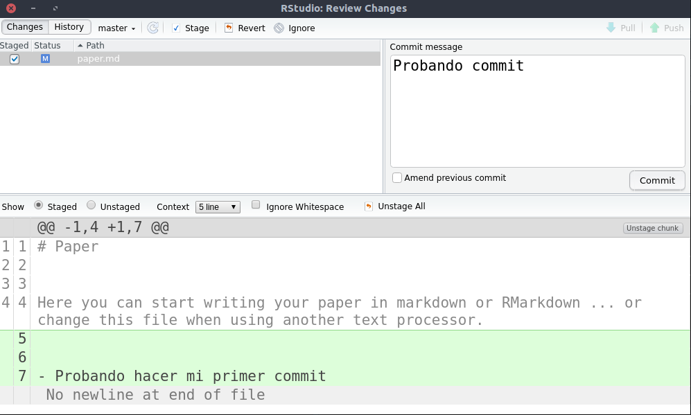
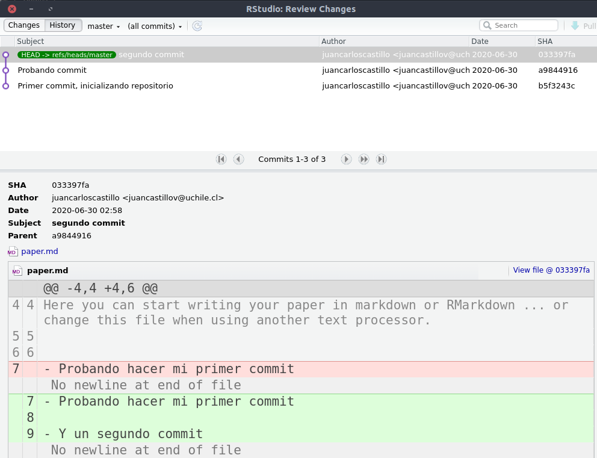
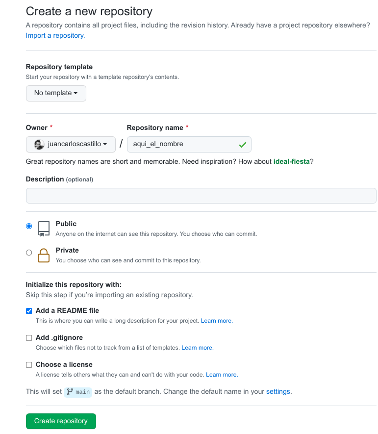
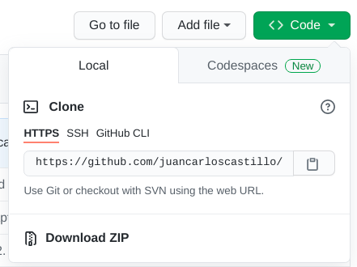
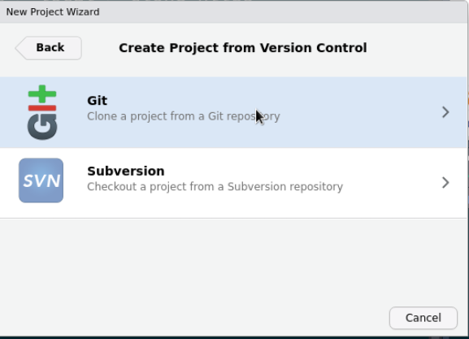
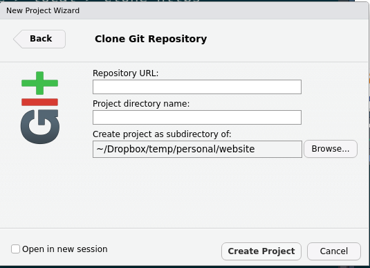
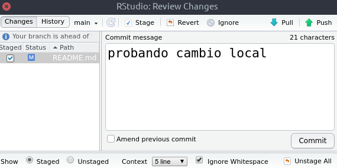
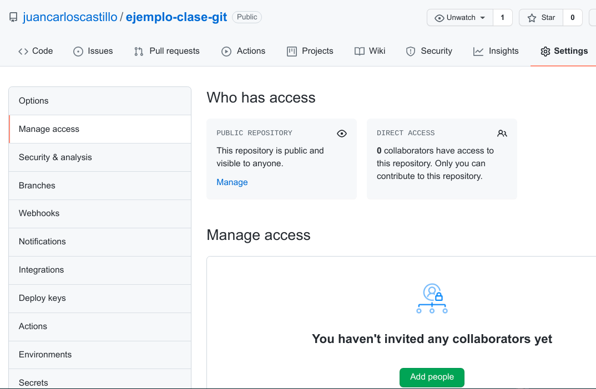

class: front

```{r eval=FALSE, include=FALSE}
# Correr esto para que funcione el infinite moonreader, el root folder debe ser static para si dirigir solo "bajando" en directorios hacia el bib y otros

1) set slides como working directory, y luego desde consola
xaringan::inf_mr('03-preregistro-OSF/03_preregistro_osf.Rmd') # correr desde TERMINAL, en R & ATOM!!


04-textoplano_bib/04_textoplano_bib.Rmd

```


```{r setup, include=FALSE, cache = FALSE}
require("knitr")
options(htmltools.dir.version = FALSE)
pacman::p_load(RefManageR)
# bib <- ReadBib("../../bib/electivomultinivel.bib", check = FALSE)
opts_chunk$set(warning=FALSE,
             message=FALSE,
             echo=FALSE,
             cache = FALSE, fig.width=7, fig.height=5.2)
pacman::p_load(flipbookr, tidyverse)
```


```{r xaringanExtra, include=FALSE}
xaringanExtra::use_xaringan_extra(c("tile_view", "animate_css"))
# xaringanExtra::use_share_again()
# xaringanExtra::use_scribble()
xaringanExtra::use_progress_bar(color = "red", location = "top", height = "100em")

```


<!---
Para correr en ATOM
- open terminal, abrir R (simplemente, R y enter)
- rmarkdown::render('static/docpres/07_interacciones/7interacciones.Rmd', 'xaringan::moon_reader')

About macros.js: permite escalar las imágenes como [scale 50%](path to image), hay si que grabar ese archivo js en el directorio.
--->


.pull-left[
# Ciencia Social Abierta
<br>
## Juan Carlos Castillo
## Sociología FACSO - UChile
## 2do Sem 2021
## [.orange[cienciasocialabierta.netlify.com]](https://cienciasocialabierta.netlify.com)
]


.pull-right[
.right[


### .yellow[Sesión 9: Repositorio remoto en Github]


]

]
---

layout: true
class: animated, fadeIn

---
class: middle

 

---
class: roja, middle, right

# Contenidos

## 1. .yellow[Repaso sesion anterior (git)]
## 2. Github
## 3. Github & RStudio

---

.center[

]

---
# RStudio: Git

- Para inicializar repositorio Git


---
# RStudio: Git
.center[

]

---
# Ejemplo: commit

.center[

]

---
.pull-left-narrow[
# Revisión de versiones anteriores]
.pull-right-wide[
.center[

]
]

---
class: roja, middle, right

.pull-left-narrow[
<br>
<br>
<br>
<br>
<br>
<br>

]

# Contenidos

## 1. Repaso sesion anterior (git)
## 2. .yellow[Github]
## 3. Github & RStudio

---
.pull-left[
# Github
- Plataforma de repositorios (carpetas de proyecto) versionables/versionados

- Vinculados a repositorios locales

- Públicos y privados (todos los visibles son públicos y clonables)
]

.pull-right[
<br>
<br>
<br>
<br>

]

---
# Github

- Además del versionamiento permite:

  - respaldo online
  
  - apertura
  
  - trabajo colaborativo compartiendo el repositorio 
  
  - sugerir cambios a otros repositorios (mediante fork)
  
  - publicación web en Github Pages

---
# Github: como funciona

- la cuenta personal de Github almacena **repositorios remotos** (web) que se pueden vincular y sincronizar con repositorios locales

--

- cualquier repositorio remoto de Github que es clonado localmente quedar **vinculado al repositorio remoto** 

--

- si se clona un repositorio **de otra cuenta** no se puede sincronizar luego con cambios locales (a menos que ese repositorio  lo incluya como colaborador)


---
class: inverse

## Github - pasos principales

1 - Crear cuenta [https://github.com/](https://github.com/)

2 - Crear repositorio

3 - Clonar repositorio

4 - Enviar o "empujar" cambios (**commits**) al repositorio (*push*)

5 - Bajar o "tirar" (*pull*l) cambios del repositorio

6 - Añadir colaboradores

---
.pull-left-narrow[
# 2. Crear repositorio
signo + en cuenta Github

(esquina superior derecha)
]

.pull-right-wide[

]

---
# 3. Clonar repo

.pull-left[
- En Github: obtener dirección para clonar: code > local > clone https

- copiar
]

.pull-right[

]


---
class: roja, middle, right

# Contenidos

## 1. Repaso sesion anterior (git)
## 2. Github
## 3. .yellow[Github & RStudio]

---
# 3. Clonar repo

- En RStudio: File > New Project > Version Control > Git
.center[
]

---
# 3. Clonar repo

.pull-left[
- pegar URL copiado en paso anterior 

- dar ruta local
]

.pull-right[


]

---
# 4. Subir cambios - **Push**

.pull-left[
- cambiar algo: contenido de un archivo, agregar nuevo archivo, borrar archivo ...

- realizar commit de esos cambios (ver sesión anterior)

- botón **push**
]

.pull-right[

]

---
# 4. Subir cambios - **Push**

- autentificación (solo primera vez): 

  - username (de cuenta de Github)
  
  - clave ... si no funciona, **generar clave especial de seguridad (token)** al interior de Github: icono personal arriba a la derecha > settings > developer settings > Personal access tokens > Generate new token

  - **guardar token** para futuros repositorios!!
  
---
# 5 - Bajar cambios - **Pull**

- situaciones:

  - haber realizado cambios directamente editando en Github
  
  - otra persona que colabora en el repositorio ha agregado cambios
  
- en RStudio: botón Pull

- (si hay algún **Pull** pendiente no permitirá hacer **Push**)

---
# 6. Añadir colaboradores
.center[

]

---
class: front


.pull-left[
# Ciencia Social Abierta
## cienciasocialabierta.netlify.com
----
## Juan Carlos Castillo
## Sociología FACSO - UChile
## 2do Sem 2021
]


.pull-right[
.right[

]


]
