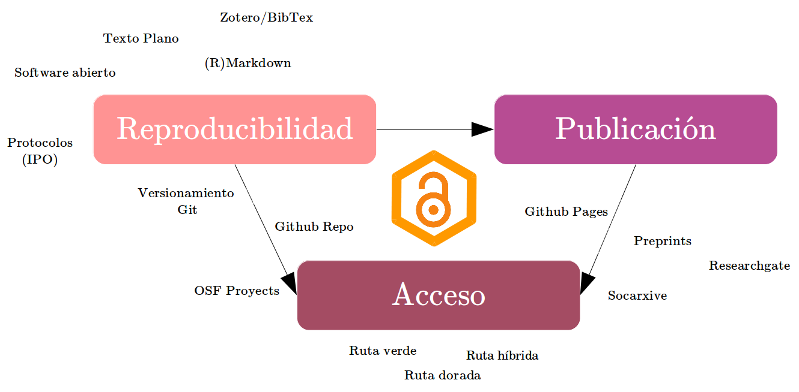
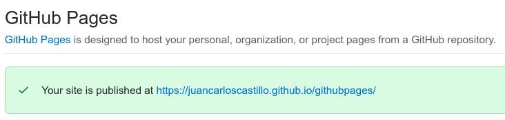

class: front

```{r eval=FALSE, include=FALSE}
# Correr esto para que funcione el infinite moonreader, el root folder debe ser static para si dirigir solo "bajando" en directorios hacia el bib y otros

1) set slides como working directory, y luego desde consola
xaringan::inf_mr('03-preregistro-OSF/03_preregistro_osf.Rmd') # correr desde TERMINAL, en R & ATOM!!


04-textoplano_bib/04_textoplano_bib.Rmd 

```


```{r setup, include=FALSE, cache = FALSE}
require("knitr")
options(htmltools.dir.version = FALSE)
pacman::p_load(RefManageR)
# bib <- ReadBib("../../bib/electivomultinivel.bib", check = FALSE)
opts_chunk$set(warning=FALSE,
             message=FALSE,
             echo=FALSE,
             cache = FALSE, fig.width=7, fig.height=5.2)
pacman::p_load(flipbookr, tidyverse)
```


```{r xaringanExtra, include=FALSE}
xaringanExtra::use_xaringan_extra(c("tile_view", "animate_css"))
# xaringanExtra::use_share_again()
# xaringanExtra::use_scribble()
xaringanExtra::use_progress_bar(color = "red", location = "top", height = "100em")

```


<!---
Para correr en ATOM
- open terminal, abrir R (simplemente, R y enter)
- rmarkdown::render('static/docpres/07_interacciones/7interacciones.Rmd', 'xaringan::moon_reader')

About macros.js: permite escalar las imágenes como [scale 50%](path to image), hay si que grabar ese archivo js en el directorio.
--->


.pull-left[
# Ciencia Social Abierta
<br>
## Juan Carlos Castillo
## Sociología FACSO - UChile
## 2do Sem 2021
## [.orange[cienciasocialabierta.netlify.com]](https://cienciasocialabierta.netlify.com)
]


.pull-right[
.right[


### .yellow[Sesión 11: Publicación web ]


]

]
---

layout: true
class: animated, fadeIn

---
class: middle

 

---




---
.pull-left[
# Publicación web con base RMarkdown

- [Rmarkdown / html](https://bookdown.org/yihui/rmarkdown/websites.html)

- [Blogdown (hugo)](https://bookdown.org/yihui/blogdown/)

- [Bookdown](https://bookdown.org/yihui/bookdown/)
]

.pull-right[


 Yihui Xie
]

---
# Publicación con base RMarkdown 

- la publicación se asocia al concepto de _deploy(ment)_

- un documento esta .red[_deployed_] cuando está renderizado y publicado en la web

- las principales plataformas gratuitas de publicación de sitios con base RMarkdown son **Github Pages** y **Netlify**

---
# Generadores de sitios

- existen también una serie de programas que permiten generar sitios en base a código/sintaxis

- los principales asociados a RMarkdown son Jekyll y Hugo.

---
class: roja bottom


# Publicación de sitios en Github pages 

## Con Rmarkdown y Jekyll

---
# Github pages

- servicio integrado a repositorios Github, en teoría de cada repositorio se puede hacer una página

- **¿Qué es lo que se publica?**

  - al menos una página, por lo general el Readme.md o index.html
  
  - páginas adicionales según objetivo y posibilidades de arquitectura del sitio

---
## En nuestro repositorio Github:

  - settings > Pages
  - seleccionar branch a publicar (por lo general _main_ o branch principal)
  - seleccionar carpeta a publicar: por defecto en raíz-root (a menos que se quiera generar el sitio en carpeta docs)
.center[
]
  - grabar (save)
 
---
## En nuestro repositorio Github (2):
 
 - después de grabar: seleccionar tema (Change theme), luego se puede cambiar

 - la dirección de la página aparece arriba:
 
 .center[
 ]
 
---
# ¿Cómo funcional?

- al repo se le agrega el archivo _config.yml, que es el generador del sitio (site generator)

- además se debe definir un archivo que será la página de inicio y que debe llamarse index.md

  - para probar se puede generar en el mismo github con "add file", pero en genera este contenido ya se trabaja de manera local 

---
class: roja bottom


# Rmarkdown websites


---
# Rmarkdown websites

- las opciones por defecto de Github pages son para páginas simples y rápidas, si se quiere crear un sitio más complejo se requieren pasos adicionales

- lo mejor es hacerlo local, por las mayores posibilidades de edición 

- para esto, clonar desde RStudio el repositorio donde se quiere hacer una página: 

  - new project -> version control -> git

---
# Transformar proyecto a sitio web

.pull-left[
- RStudio / Knitr también permiten generar el sitio basados en [Jekyll](https://jekyllrb.com/) (no es necesario manejarlo para generar el sitio)

- Es una forma simple y rápida de generar y publicar páginas, sin grandes opciones de estructura.

]

--

.pull-right[
## Pasos

1. Creación de archivos básicos

2. Adaptación del sitio

3. Generación del sitio]

---
# 1. Creación de archivos básicos.

- AL igual que en Github pages, necesitamos al menos dos archivos: 

  - index

  - y un **_.yml**, que en este caso es **_site.yml**


---
# 1. Creación de archivos básicos.

## index

- Es la página inicial del sitio

- Para generarlo, simplemente crear un archivo index.Rmd con la información que se desee mostrar al inicio del sitio (se puede modificar luego)

- Luego se renderiza a index.html

- (También se pueden agregar más páginas posteriormente) 

---
# 2. Configuración del sitio en _site.yml

- El sitio está definido básicamente por:

  - Nombre del sitio
  
  - Barra de navegación (navbar)

---
# 2. Adaptación del sitio

- Pensando en un proyecto basado en protocolo IPO donde nos interesa publicar nuestro archivo _paper_, entonces:

```
name: "Nombre"
output_dir: "."
navbar:
  title: "Ejemplo WEB"
  left:
  - text: "Paper"
    href: paper.html

```

---
# 2. Adaptación del sitio

- Opciones adicionales: 

  - incluir más páginas html 
  
  - añadir íconos/links en la barra mediante [fonts-awesome](https://fontawesome.com/)
  
  - cambiar el tema general del sitio (theme)
  
  - cambios más específicos de formatos mediante css

---


---
.medium[
```
name: "Mi Nombre"
output_dir: "."
navbar:
  title: "Ejemplo WEB"
  left:
  - text: "Paper"
    href: paper.html
  right:
  - icon: fa-envelope fa-lg
    href: (aquí correo)
  - icon: fa-github fa-lg
    href: http://repositorio-del-sitio
output:
  html_document:
    theme: cerulean # yeti  spacelab simplex sandstone cosmo cerulean paper darkly flatly lumen readable
    css: 'styles.css'
```]

---
# 3. Generación del sitio

- la inclusión de los archivos index.html y _site.yml permite generar el sitio web

- el comando es `rmarkdown::render_site()`

- también puede ser con el botón Build Website en Rstudio:

 

(para que aparezca hay que reiniciar RStudio)

---
# 3. Generación del sitio

- La generación del sitio se basa en las instrucciones y archivos que están en la carpeta `site_libs`, que aparece en nuestro directorio.

- **NO BORRAR**

---
# Publicación de vuelta en Github

- como en el repo del que clonamos ya estaba activada la opción de pages, basta con hacer commit y push y se actualiza el sitio

- en caso de generar primero el sitio localmente, entonces una vez actualizado el repositorio se debe activar la opción de Github pages

---
class: inverse

## Resumen

- Archivos básicos para generar sitio: index.Rmd/index.html, _site.yml

- Configuración de _site.yml

- Renderizar local, subir cambios a repositorio

- En Github Settings - > Gihub pages

---
# Bonus-track

- [Tesisfacsodown](https://juancarloscastillo.github.io/tesisfacsodown/)

- [Presentaciones con Xaringan](https://bookdown.org/yihui/rmarkdown/xaringan.html)


---
class: front


.pull-left[
# Ciencia Social Abierta
## cienciasocialabierta.netlify.com
----
## Juan Carlos Castillo
## Sociología FACSO - UChile
## 2do Sem 2021
]


.pull-right[
.right[

]


]
