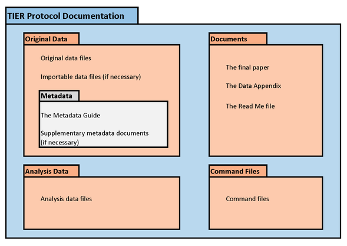

class: front

```{r eval=FALSE, include=FALSE}
# Para que funcione el infinite moon reader, correr desde el root!
```

```{r setup, include=FALSE, cache = FALSE}
require("knitr")
options(htmltools.dir.version = FALSE)
pacman::p_load(RefManageR)
# bib <- ReadBib("../../bib/electivomultinivel.bib", check = FALSE)
opts_chunk$set(warning=FALSE,
             message=FALSE,
             echo=TRUE,
             cache = TRUE,fig.width=7, fig.height=5.2)
```

<!---
Para correr en ATOM
- open terminal, abrir R (simplemente, R y enter)
- rmarkdown::render('static/docpres/07_interacciones/7interacciones.Rmd', 'xaringan::moon_reader')

About macros.js: permite escalar las imágenes como [scale 50%](path to image), hay si que grabar ese archivo js en el directorio.
--->


.pull-left[
# Ciencia Social Abierta
## cienciasocialabierta.netlify.app
----
## Juan Carlos Castillo
## Sociología FACSO - UChile
## 1er Sem 2020
]


.pull-right[
.right[

]


## Sesión 6: *Flujo de trabajo reproducible*
]

---

layout: true
class: animated, fadeIn

---

# ¿Cómo organizar el flujo de trabajo?


---
# ¿Cómo organizar el flujo de trabajo?

A. ad-hoc (menos reproducible)
  - cada investigador define numero de archivos, nombres, carpetas y organización
  - explicar al resto cómo se organiza
  - documentar en un archivo cómo se organiza
  
--> reproducibilidad y transparencia **LIMITADA**  

---
# ¿Cómo organizar el flujo de trabajo?

B. *Protocolo* de trabajo reproducible

  - **estructura** de carpetas y archivos interconectados que refieren a un estándar de estructura
  
  - **autocontenido**: toda la información necesaria para la reproducibilidad se encuentra en la carpeta raíz o directorio de trabajo.

---
# Protocolos reproducibles

.center[

]

---
# Ejemplo protocolo reproducible: [TIER](https://www.projecttier.org/)
.center[

]

---
.pull-left-narrow[
# Protocolo TIER
]

.pull-right-wide[

]

---
class: roja, middle, center

# Protocolo IPO

---
.center[

]

---
# Protocolo IPO - Estructura de archivos y carpetas


---
# Protocolo IPO y artículos en RMarkdown

- RMarkdown tiene una lógica en sí reproducible, y puede simplificar el uso de protocolos.

- Si todo el procesamiento se hace en el mismo documento paper.Rmd, entonces basta con la carpeta input de IPO.

- Alternativa (recomendada): hacer la preparación en código externo (carpeta proc) y el análisis en el paper.Rmd.

- Es solo una **propuesta**, el sentido último es la reproducibilidad más que el cumplimiento estricto

---
# Protocolo IPO


- mayores detalles y plantilla de carpetas:

.center[

# https://juancarloscastillo.github.io/ipo

]


---
# Flujo de trabajo reproducible

## A- directorio de trabajo

## B- rutas relativas

## C- dinámica flujo

---
# Directorio de trabajo

- proyecto **autocontenido**: reproducible sin necesidad de archivos externos

- requisito: establecer **directorio de trabajo**

  - posición de referencia de todas las operaciones al interior del proyecto
  
  - también llamado **directorio raíz**
  
---
# Estableciendo directorio de trabajo

- forma tradicionalen R: 

  - `setwd(ruta-a-carpeta-de-proyecto)`

  - problemas: hace referencia a ruta local en el computador donde se está trabajando, por lo tanto no es reproducible y **se debe evitar**
  
- alternativa sugerida en R: **RStudio Projects**  

---
# RStudio Projects

- La funcionalidad **Projects** de RStudio permite establecer claramente un directorio de trabajo de manera eficiente

- Para ello, genera un archivo de extensión **.Rproj** en el directorio raiz de la carpeta del proyecto

- Luego se facilita acceder a la carpeta del proyecto en RStudio ejecutando desde el administrador de archivos del computador (file manager) el archivo **.Rproj** 

- para comprobar, ejecutar `getwd()` y debería dar la ruta hacia la carpeta del proyecto

---

.pull-left[
# RStudio Projects
- File -> New Project


]

.pull-right[
<br>
<br>
<br>
<br>
<br>

]

---
# RStudio Projects

.center[

]


---
# Rutas relativas

- forma de "señalar el camino" para abrir y guardar archivos al interior de una carpeta de proyecto autocontenido (= sin referencias locales)

- este camino tiene básicamente 3 direcciones:

  - bajar -> hacia subcarpetas
  
  - subir -> hacia carpetas superiores
  
  - subir y bajar -> hacia otras subcarpetas 

---
# Rutas relativas: bajando

- para **"bajar"** hacia a una subcarpeta, simplemente damos la ruta de la carpeta/archivo

  - ej: si estoy en el archivo paper.Rmd (directorio raíz), y quiero incluir una imagen (directorio input/images/imagen.jpg), entonces la ruta es `input/images/imagen.jpg`
  
  - o para señalar la ruta al bib desde paper.Rmd (en raíz): `input/bib/referencias.bib`

---
# Rutas relativas: subiendo

- para **subir** se utilizan los caracteres `../` por cada nivel.

- Ej: si quiero guardar una tabla en el directorio raíz generada desde un archivo de código en la subcarpeta proc, entonces la ruta es `../tabla.html`

---
# Rutas relativas: subiendo y bajando 

- combinación de las anteriores

- Ej: para abrir la base de datos original en la subcarpeta input/data desde el código de procesamiento en la subcarpeta proc, entonces: `../input/data/original.dat`

---
# Diagrama flujo principal de trabajo


---
class: inverse

# Resumen

## - protocolos (mapa)

## - rutas relativas (caminos)


---
class: front


.pull-left[
# Ciencia Social Abierta
## cienciasocialabierta.netlify.com
----
## Juan Carlos Castillo
## Sociología FACSO - UChile
## 1er Sem 2020
]


.pull-right[
.right[

]


]
