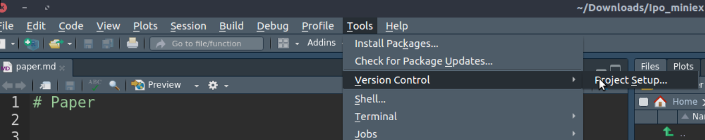

class: front


```{r eval=FALSE, include=FALSE}
# Para que funcione el infinite moon reader, correr desde el root!
```

```{r setup, include=FALSE, cache = FALSE}
require("knitr")
options(htmltools.dir.version = FALSE)
pacman::p_load(RefManageR)
# bib <- ReadBib("../../bib/electivomultinivel.bib", check = FALSE)
opts_chunk$set(warning=FALSE,
             message=FALSE,
             echo=TRUE,
             cache = TRUE,fig.width=7, fig.height=5.2)
```

<!---
Para correr en ATOM
- open terminal, abrir R (simplemente, R y enter)
- rmarkdown::render('static/docpres/07_interacciones/7interacciones.Rmd', 'xaringan::moon_reader')

About macros.js: permite escalar las imágenes como [scale 50%](path to image), hay si que grabar ese archivo js en el directorio.
--->


.pull-left[
# Ciencia Social Abierta
## cienciasocialabierta.netlify.app
----
## Juan Carlos Castillo
## Sociología FACSO - UChile
## 1er Sem 2020
]


.pull-right[
.right[

]

## Sesión 8: *Git & Github*
]

---

layout: true
class: animated, fadeIn

---

.center[

]

---
# RStudio: Git

- Para inicializar repositorio Git




---
# RStudio: Git
.center[

]

---
# Ejemplo: commit

.center[

]

---
.pull-left-narrow[
# Revisión de versiones anteriores]
.pull-right-wide[
.center[

]
]

---
class: roja, middle, center

.pull-left-wide[

]

# Github
---
# Github

1 - Crear cuenta [https://github.com/](https://github.com/)

2 - Crear repositorio

3 - Clonar repositorio

4 - Enviar o "empujar" cambios (**commits**) al repositorio (*push*)

5 - Bajar o "tirar" (*pull*l) cambios del repositorio

6 - Añadir colaboradores

---
.center[

]

---
class: front


.pull-left[
# Ciencia Social Abierta
## cienciasocialabierta.netlify.com
----
## Juan Carlos Castillo
## Sociología FACSO - UChile
## 1er Sem 2020
]


.pull-right[
.right[

]


]
