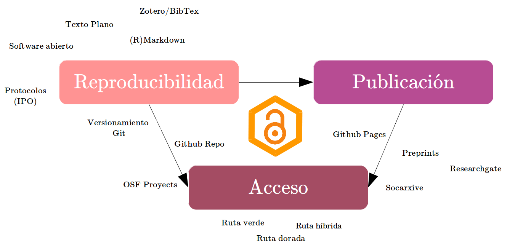
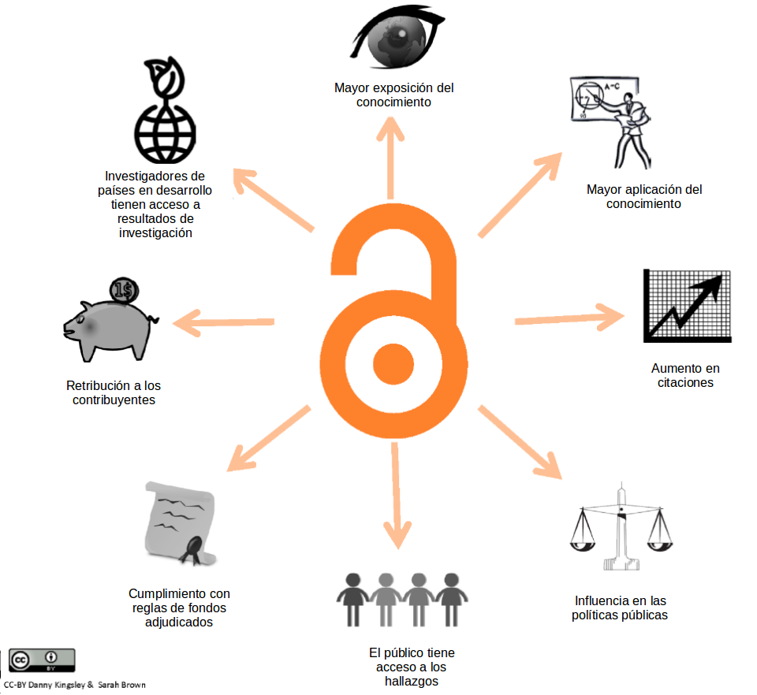
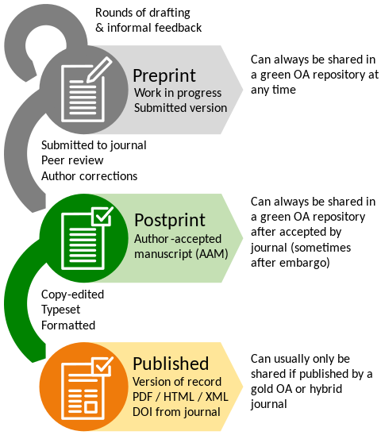
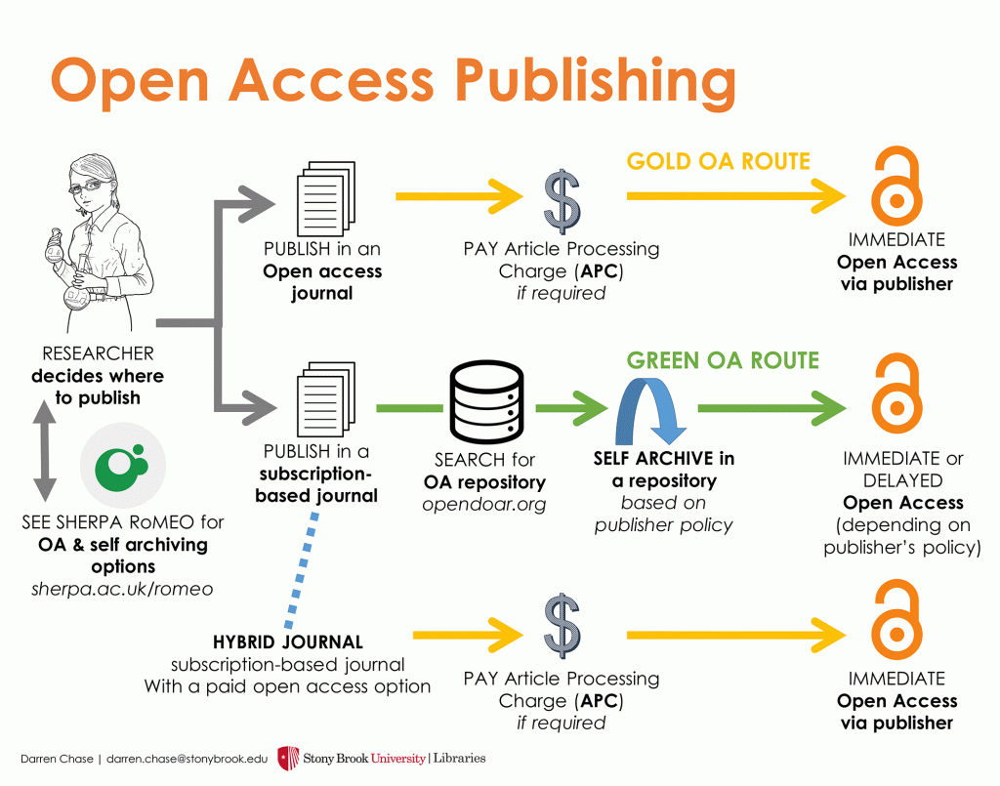
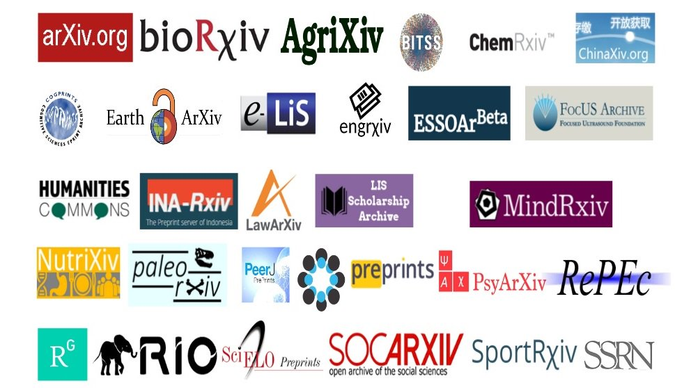
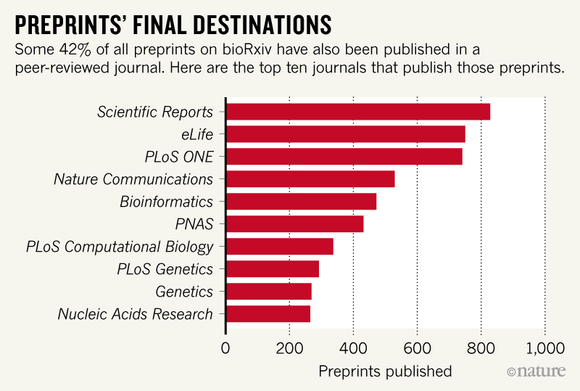
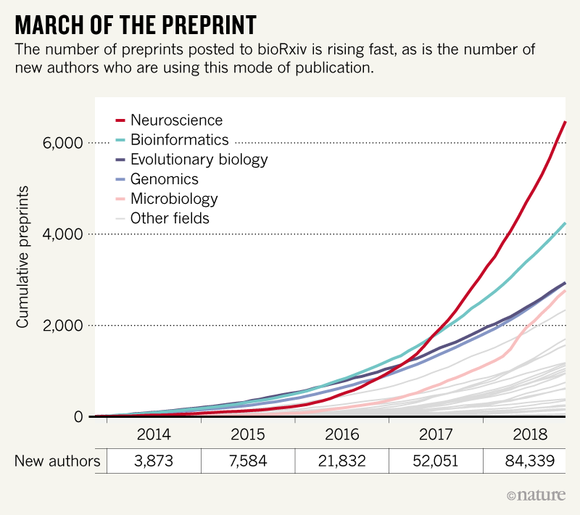
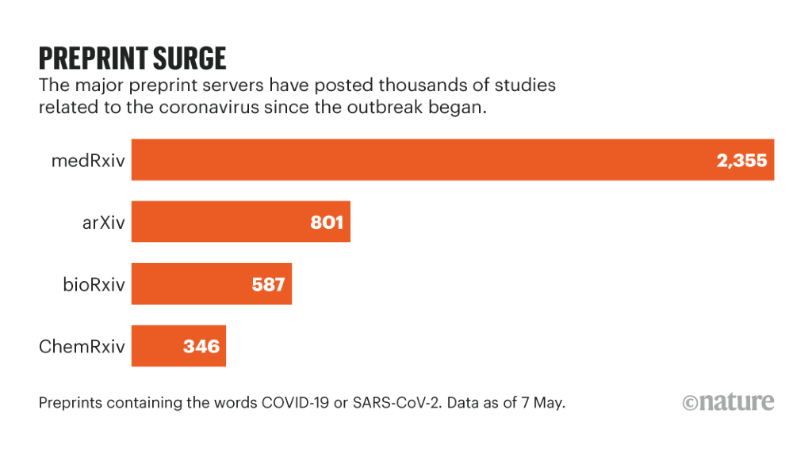
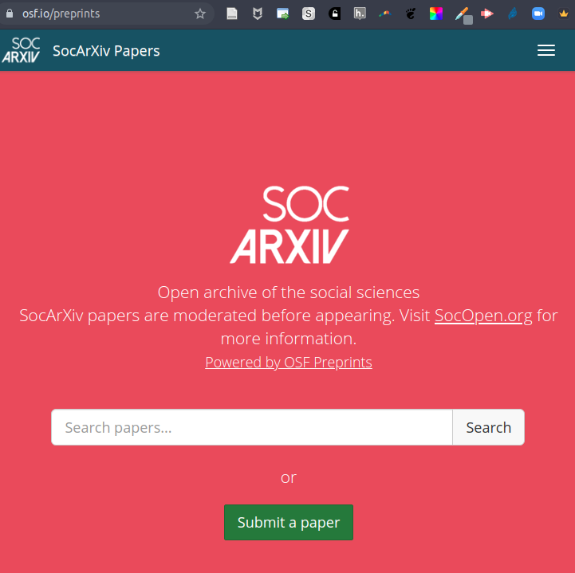
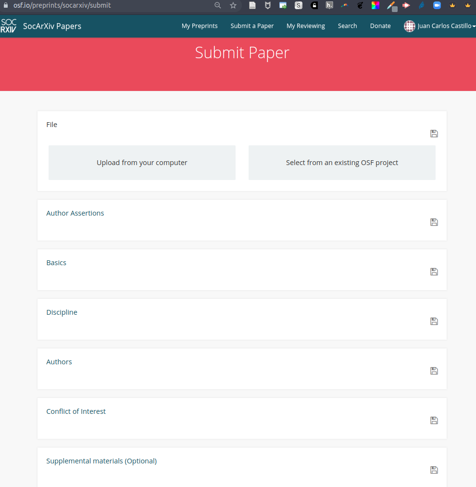

class: front


```{r eval=FALSE, include=FALSE}
# Para que funcione el infinite moon reader, correr desde el root!
```

```{r setup, include=FALSE, cache = FALSE}
require("knitr")
options(htmltools.dir.version = FALSE)
pacman::p_load(RefManageR)
# bib <- ReadBib("../../bib/electivomultinivel.bib", check = FALSE)
opts_chunk$set(warning=FALSE,
             message=FALSE,
             echo=TRUE,
             cache = TRUE,fig.width=7, fig.height=5.2)
```

<!---
Para correr en ATOM
- open terminal, abrir R (simplemente, R y enter)
- rmarkdown::render('static/docpres/07_interacciones/7interacciones.Rmd', 'xaringan::moon_reader')

About macros.js: permite escalar las imágenes como [scale 50%](path to image), hay si que grabar ese archivo js en el directorio.
--->


.pull-left[
# Ciencia Social Abierta
## cienciasocialabierta.netlify.app
----
## Juan Carlos Castillo
## Sociología FACSO - UChile
## 1er Sem 2020
]


.pull-right[
.right[

]

## Sesión 10: *Preprints - Socarxiv*
]

---

layout: true
class: animated, fadeIn

---

.pull-left-narrow[
# Open
# Science
# Framework
]

.pull-right-wide[
.center[]
]


---
# Juntando las piezas


.center[]


---
class: roja, bottom, right

# Acceso a las publicaciones

---

.center[]


---
# Bases

- [Declaración de Budapest 2002](https://www.budapestopenaccessinitiative.org/read)

.medium[
_By "open access" to this literature, we mean its **free availability on the public internet**, permitting any users to read, download, copy, distribute, print, search, or link to the full texts of these articles, crawl them for indexing, pass them as data to software, or use them for any other lawful purpose, without financial, legal, or technical barriers other than those inseparable from gaining access to the internet itself. The only constraint on reproduction and distribution, and the only role for copyright in this domain, should be to give authors control over the integrity of their work and the right to be properly acknowledged and cited._]

---
# Bases

- [Declaración de Berlin 2003](https://openaccess.mpg.de/67605/berlin_declaration_engl.pdf)

.medium[
1. The author(s) and right holder(s) of such contributions grant(s) to all users a free, irrevocable,
worldwide, right of access to, and a license to copy, use, distribute, transmit and display the work
publicly ...

2. A complete version of the work and all supplemental materials, including a copy of the permission
as stated above, in an appropriate standard electronic format is deposited (and thus published) in at
least one online repository

]


.small[Más información: [European Comission Open Acces](https://ec.europa.eu/research/participants/docs/h2020-funding-guide/cross-cutting-issues/open-access-data-management/open-access_en.htm) ]
---
class: inverse, middle, center

# Rutas de accesibilidad

---

.center[

]
---
.center[

]


---
class: middle

Información sobre políticas de acceso de las revistas: [https://v2.sherpa.ac.uk/romeo/](https://v2.sherpa.ac.uk/romeo/)

---
class: roja, bottom, right

# Pre-prints

---
# Preprints

- Los preprints o pre-impresos son publicaciones abiertas de un reporte de investigación, por lo general un artículo, antes de un proceso de revisión por pares

- El objetivo general hacer disponibles y difundir reportes de investigación

- Son referenciables / citables / accesibles

- Pueden ser una versión inicial/borrador o una versión final

- Concepto general: **ciencia en tiempo real**

---


---



.small[
[https://www.natureindex.com/news-blog/what-biorxivs-first-thirty-thousand-preprints-reveal-about-biologists](https://www.natureindex.com/news-blog/what-biorxivs-first-thirty-thousand-preprints-reveal-about-biologists)
]
---
.center[

]
---



---

.pull-left-narrow[


[socopen.org](https://socopen.org/)

]

.pull-right-wide[
- Servicio de pre-prints de ciencias sociales vinculado al OSF

- Permite subir documentos (pdf) fácilmente desde proyectos OSF

- Tiene un sistema de _moderación_, un equipo de moderadores realiza un filtro grueso para determinar el carácter académico del pre-print

- Otorga un DOI (digital object identifier), que permite su citación y rastreo académico
]

---
.center[

]
---

.center[

]
---

# Sobre las licencias de trabajos abiertos

- permiten resguardar el derecho de propiedad y reconocimiento (atribución) de quienes crean la obra

- diferentes elementos:
  - posibilidad de "derivar" (adaptar) y publicar un nuevo producto
  - posibilidad de generar derivados comerciales
  - posibilidad de que derivados tengan distintas licencias
  
- más información: [https://creativecommons.org/licenses/](https://creativecommons.org/licenses/)


---
class: inverse

## Resumen

- Políticas y rutas de acceso abierto

- Auge creciente de preprints

- Publicación en Socarxiv

- En general se piensa la apertura (access) como la disponibilidad del artículo final

---
class: front


.pull-left[
# Ciencia Social Abierta
## cienciasocialabierta.netlify.com
----
## Juan Carlos Castillo
## Sociología FACSO - UChile
## 1er Sem 2020
]


.pull-right[
.right[

]


]
