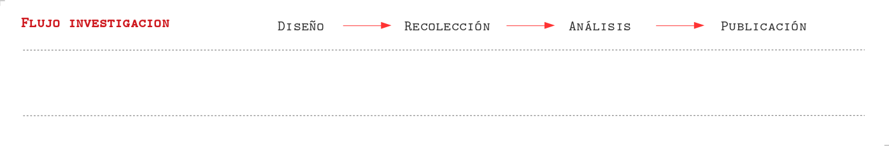
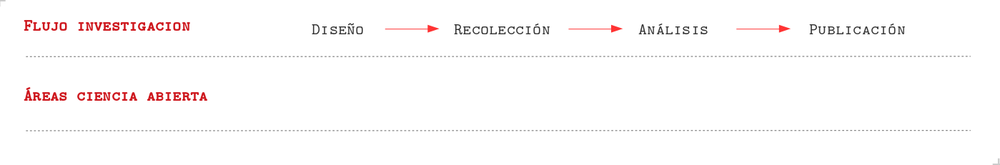
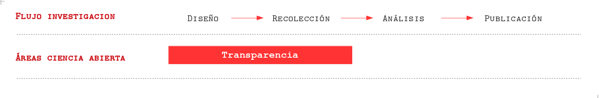
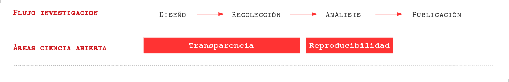
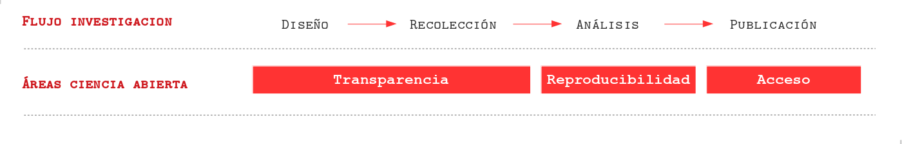

class: front

```{r eval=FALSE, include=FALSE}
# Correr esto para que funcione el infinite moonreader, el root folder debe ser static para si dirigir solo "bajndo" en directorios hacia el bib y otros

xaringan::inf_mr('/static/docpres/02_bases/2mlmbases.Rmd')

o en RStudio:
  - abrir desde carpeta root del proyecto
  - Addins-> infinite moon reader
```


```{r setup, include=FALSE, cache = FALSE}
require("knitr")
options(htmltools.dir.version = FALSE)
pacman::p_load(RefManageR)
# bib <- ReadBib("../../bib/electivomultinivel.bib", check = FALSE)
opts_chunk$set(warning=FALSE,
             message=FALSE,
             echo=FALSE,
             cache = FALSE, fig.width=7, fig.height=5.2)
pacman::p_load(flipbookr, tidyverse)
```


```{r xaringanExtra, include=FALSE}
xaringanExtra::use_xaringan_extra(c("tile_view", "animate_css"))
# xaringanExtra::use_share_again()
xaringanExtra::use_scribble()
```


<!---
Para correr en ATOM
- open terminal, abrir R (simplemente, R y enter)
- rmarkdown::render('static/docpres/07_interacciones/7interacciones.Rmd', 'xaringan::moon_reader')

About macros.js: permite escalar las imágenes como [scale 50%](path to image), hay si que grabar ese archivo js en el directorio.
--->


.pull-left[
# Ciencia Social Abierta
## Juan Carlos Castillo
## Sociología FACSO - UChile
## 2do Sem 2021
## [.orange[cienciasocialabierta.netlify.app]](https://cienciasocialabierta.netlify.app)
]


.pull-right[
.right[
<br>
## .orange[Sesión 1: Presentación]


]

]
---

layout: true
class: animated, fadeIn

---

class: roja, middle, right


# .yellow[¿Crisis de apertura en ciencia?]

## 1. Transparencia
## 2. Reproducibilidad 
## 3. Acceso

---
class: roja, middle, right


# .yellow[¿Crisis de apertura en ciencia?]

## 1. .yellow[Transparencia]
## 2. Reproducibilidad 
## 3. Acceso

---
## Flujo de investigación científica



---
## Flujo de investigación científica y ciencia abierta



---
## Flujo de investigación científica y ciencia abierta



---
## Transparencia 1: Diseño

- Presión por publicar resultados "relevantes" (rechazar $H_0$ )

--

- .red[HARKing]: Hypothesis After the Results are Known

  - Se adaptan las hipótesis y teorías a los resultados
  
  - Barreras al avance del conocimiento ya que solo conocemos lo que "resulta"
  
---
## Transparencia 2: Datos

- Dificultades en el acceso y la documentación de la información levantada  en la investigación

--

- Barreras la reproducibilidad y al avance de investigaciones con datos muchas veces levantados con fondos públicos


---
class: roja, middle, right


# .yellow[¿Crisis de apertura en ciencia?]

## 1. Transparencia
## 2. .yellow[Reproducibilidad] 
## 3. Acceso

---
# Reproducibilidad




---
### ¿Qué porcentaje de los estudios publicados son reproducibles?

.pull-left-wide[

]
.pull-right-narrow[
<br>
<br>
<br>
<br>
<br>
<br>
... alrededor de un **40%!** (... varía por disciplina)
]
---
# ¿Por qué se ocurre la crisis de reproducibilidad?

Algunas razones:

- pobre documentación metodológica

- sesgo hacia búsqueda y publicación de resultados significativos (p-hacking), atribuido a la presión por publicar

- en algunos casos, falseamiento de datos/análisis

---
class: roja, middle, right


# .yellow[¿Crisis de apertura en ciencia?]

## 1. Transparencia
## 2. Reproducibilidad
## 3. .yellow[Acceso]


---
## Acceso



---
### El ciclo actual de publicación científica
.center[

]

.right[
.tiny[
(Adaptado de: [https://creativecommons.org/about/program-areas/open-access/](https://creativecommons.org/about/program-areas/open-access/))
]
]
---
class: middle, center

.pull-left[
## Barreras de pago
]
.pull-right[
.left[

]
]

---
### Márgenes de ganancia

.center[

]

---
.pull-left-narrow[
## Beneficios acceso abierto

<br>
<br>

.tiny[
Adaptado de: [http://whyopenresearch.org/#](http://whyopenresearch.org/)
]
]

.pull-right-wide[
.center[

]

]


---
class: roja, middle, center

# Este curso

---
## Enfrentando la crisis

- tema de **ética** científica y también de **eficiencia**

- por ahora en Chile, la apertura depende de la **voluntad de los investigadores**, pero ... 

- crecientemente financistas y medios de publicación  se hacen **más exigentes**, gobiernos extranjeros ya han implementado políticas de transparencia, acceso y reproducibilidad.

- necesidad de **herramientas metodológicas** 

---
## Resumen


---
class: front
.pull-left[
# Ciencia Social Abierta
<br>
<br>
## Sociología FACSO - UChile
## 2do Sem 2021
## [.orange[cienciasocialabierta.netlify.app]](https://cienciasocialabierta.netlify.app)
]


.pull-right[
.right[
<br>


]

]

