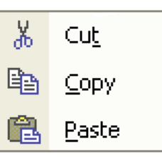
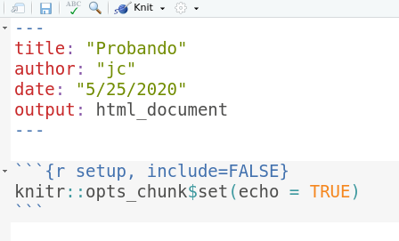
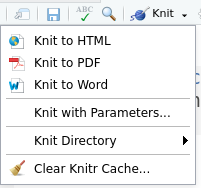
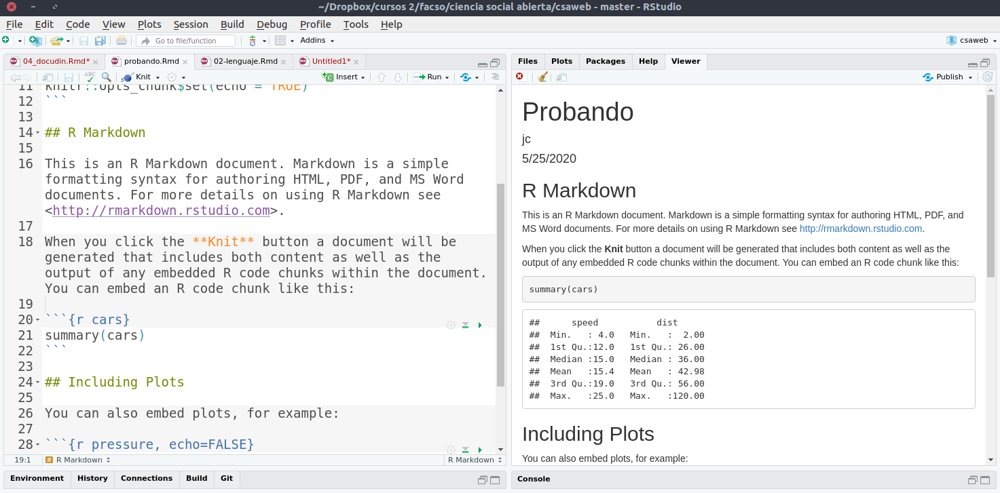

class: front

```{r eval=FALSE, include=FALSE}
# Correr esto para que funcione el infinite moonreader, el root folder debe ser static para si dirigir solo "bajando" en directorios hacia el bib y otros

1) set slides como working directory, y luego desde consola
xaringan::inf_mr('03-preregistro-OSF/03_preregistro_osf.Rmd') # correr desde TERMINAL, en R & ATOM!!


04-textoplano_bib/04_textoplano_bib.Rmd

```


```{r setup, include=FALSE, cache = FALSE}
require("knitr")
options(htmltools.dir.version = FALSE)
pacman::p_load(RefManageR)
# bib <- ReadBib("../../bib/electivomultinivel.bib", check = FALSE)
opts_chunk$set(warning=FALSE,
             message=FALSE,
             echo=FALSE,
             cache = FALSE, fig.width=7, fig.height=5.2)
pacman::p_load(flipbookr, tidyverse)
```


```{r xaringanExtra, include=FALSE}
xaringanExtra::use_xaringan_extra(c("tile_view", "animate_css"))
# xaringanExtra::use_share_again()
xaringanExtra::use_scribble()
```


<!---
Para correr en ATOM
- open terminal, abrir R (simplemente, R y enter)
- rmarkdown::render('static/docpres/07_interacciones/7interacciones.Rmd', 'xaringan::moon_reader')

About macros.js: permite escalar las imágenes como [scale 50%](path to image), hay si que grabar ese archivo js en el directorio.
--->


.pull-left[
# Ciencia Social Abierta
<br>
## Juan Carlos Castillo
## Sociología FACSO - UChile
## 2do Sem 2021
## [.orange[cienciasocialabierta.netlify.app]](https://cienciasocialabierta.netlify.app)
]


.pull-right[
.right[


### .yellow[Sesión 6: Documentos dinámicos / RMarkdown]


]

]
---

layout: true
class: animated, fadeIn

---
class: middle


---
class: roja, bottom, right

# Documentos dinámicos

---
# Problemas de reproducibilidad en documentos de investigación

.pull-left[

- Proceso tradicional: cortar y pegar resultados en el documento de texto

- Dificulta la **reproducibilidad**: ¿de dónde salieron esos resultados?
]


.pull-right[
.center[

]
]

---
# Desafiando el modelo cortar & pegar

- **Ideal de reproducibilidad**: documento donde se combine texto y código que genera resultados presentados.

- **Limitación procesadores de texto**: no permiten incorporar código & resultados de manera eficiente

- **Limitación software de análisis**: permiten incorporar texto solo en un formato plano, no publicable

---
# Alternativa en entorno R: Knitr (Tejer)

.pull-left-narrow[


]

.pull-right-wide[
- Librería R que genera documentos dinámicos, combinando (tejiendo) texto y código en una misma hoja

- Diferentes opciones de formato de salida (html, pdf, word)

- Basada en una versión de Markdown llamada RMarkdown

]


---
# Funcionamiento ([Healey](https://plain-text.co/))


---
# Funcionamiento

1. Artículo `RMarkdown` (.Rmd) combina texto plano Markdown y código de análisis `R`

2. `Knitr` (_cniter_ o _kaniter_) genera un archivo Markdown (.md) a partir del Rmd

3. El archivo Markdown puede ser transformado por `pandoc` a diferentes formatos de salida publicable

.small[Nota: `pandoc` se instala automáticamente con RStudio, no requiere instalación aparte]

---
class: inverse

## .orange[Resumen]

- Cortar y pegar dificulta la reproducibilidad

--

- Documentos dinámicos combinan texto y código de análisis, permitiendo mayor reproducibilidad

--

- En R la generación de documentos dinámicos opera mediante la librería `knitr`, que convierte documentos RMarkdown a Markdown

---
class: roja, bottom, right


# RMarkdown

---
# RMarkdown: Acepciones

.pull-left-narrow[

]

.pull-right-wide[
- Lenguaje que combina código (R) y texto (Markdown)

- Hoja de código escrita en RMarkdown (documento RMarkdown)

- Librería de R que provee de una serie de herramientas para generar documentos dinámicos y publicarlos
]
---
# Librería RMarkdown

- Instalar la librería (o actualizarla, si está cargada) : `install.packages("rmarkdown")`

- Al instalarla, también incorpora otras librerías (dependencies) que permiten trabajar y publicar con **RMarkdown** (como `knitr` y también `tinitex`, que permite generación documentos pdf vía Latex).


---
# Iniciar documento RMarkdown en RStudio

- RStudio ha ido progresivamente incorporando adaptaciones a la escritura en RMarkdown

- Para generar documento RMarkdown: File > New File > R Markdown

- Luego pide unas opciones para generar un documento ejemplo (posteriormente se puede borrar el contenido).

---
# Iniciar documento RMarkdown en RStudio

.center[

]
---
# Iniciar documento RMarkdown en RStudio

.pull-left-narrow[
<br>

]

.pull-right-wide[


- El documento ejemplo tiene un breve encabezado YAML (Yet Another Markdown Language), donde se especifican opciones generales del documento entre tres guiones (`---`)

- También por defecto genera un chunk inicial de opciones (setup) para todo el documento (opcional)

]

---
# Escritura en RMarkdown

- permite incluir **trozos de código (chunks)**  en el texto

- un chunk se especifica mediante una línea de código inicial ` ```{r}`, y se cierra con ` ``` `

`Aquí texto `

````
```{r}`r ''`
1 + 1
```
````
`Aquí sigue el texto`

---
# Insertar chunks

Se pueden insertar rápidamente de la siguiente manera:

- Menú en ventana de RStudio *Insert* > R 

- o, combinación Ctrl + Alt + i

---
class: inverse, middle, right

# Opciones de chunks

---
# Opciones (principales) de chunks

1. Mostrar código y resultado

2. Mostrar solo el código

3. Mostrar solo el resultado

4. No mostrar ni código ni resultado

5. Mostrar código sin ejecutarlo

6. Entregar resultado en formato directo (ej: html o latex)

---
# Especificación de opciones

- las opciones se anotan dentro de la llave inicial posterior a la letra r: `{r [opciones]}`

- las opciones principales son:

  - mostrar código `{r echo=TRUE/FALSE}`
  - mostrar resultado `{r results='markup'/'hide'}`

- estas opciones se visualizan al momento de procesar el documento en algún formato de salida. A este procesamiento se le denomina **renderizar** (del ingles _render_ ... no hay buena traducción)

---
# 1. Mostrar código y resultado (opción por defecto)

````
```{r}`r ''`
1 + 1
```
````
(equivale a `{r echo=TRUE results='markup'}`)

Renderiza

```{r}
1 + 1
```

---
# 2. Solo código, ocultando resultados:

````
```{r, results='hide'}`r ''`
1 + 1
```
````

Renderiza:

```{r results='hide'}
1 + 1
```

---
# 3. Solo resultado

````
```{r, echo=FALSE}`r ''`
1 + 1
```
````

Renderiza:

```{r, echo=FALSE}
1 + 1
```

---
# 4. Ni código ni resultado

````
```{r echo=FALSE results='hide'}`r ''`
1 + 1
```
````

No renderiza

Se usa cuando se ejecuta un comando necesario pero que no se requiere/necesita dejar visible en el documento de salida (Ej: cargar base de datos)


---
# 5. Código sin ejecutar

````
```{r, eval=FALSE}`r ''`
1 + 1
```
````

Se puede usar para dar un ejemplo de código que no requiere ser ejecutado


---
# 6. Resultado en formato directo de salida


````
```{r, results='asis'}`r ''`
stargazer(datos1, type="html")
```
````

- se utiliza principalmente para comandos de generación de tablas, que arrojan un código que luego puede ser interpretado por otro lenguaje (por ejemplo, html o LaTeX)

---
class: roja bottom right

# Knitr

---
.pull-left-wide[
## Generando documento con Knitr
- Knitr es una librería de R, se instala automáticamente al instalar `rmarkdown`

- El documento se genera al presionar el botón `Knitr` (que activa función de la librería)

- También al desplegar el menú se pueden elegir opciones de formato
]

.pull-right-narrow[
.right[
<br>
<br>
<br>

]
]

---
# Sobre formatos de salida

- La conversión más simple y rápida es a html.

- El resultado aparece en el visor (Viewer) de R, o se puede seleccionar otra opción de visualización desde la rueda de configuración al lado del botón `knitr`

- El documento queda grabado como archivo (ej: probando.html) en el mismo directorio del archivo .Rmd

---
## Sobre formatos de salida: En Visor de RStudio



---
class: inverse

## Resumen

- Documentos dinámicos:

  - "tejiendo" texto y código de análisis en texto plano
  - reproducibilidad

- Documentos dinámicos en R / RStudio

  - knitr
  - RMarkdown
  - chunks y opciones

---
class: roja, middle, center, slideInRight

## Próxima clase:

# Flujo Reproducible


---
class: front


.pull-left[
# Ciencia Social Abierta
## cienciasocialabierta.netlify.app
----
## Juan Carlos Castillo
## Sociología FACSO - UChile
## 2do Sem 2021
]


.pull-right[
.right[

]


]
