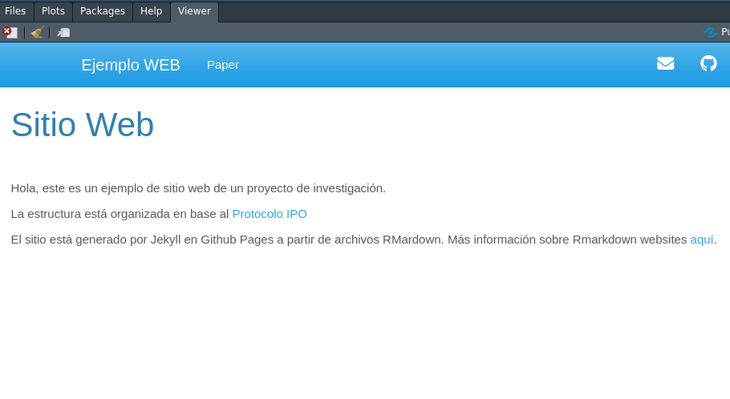
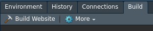
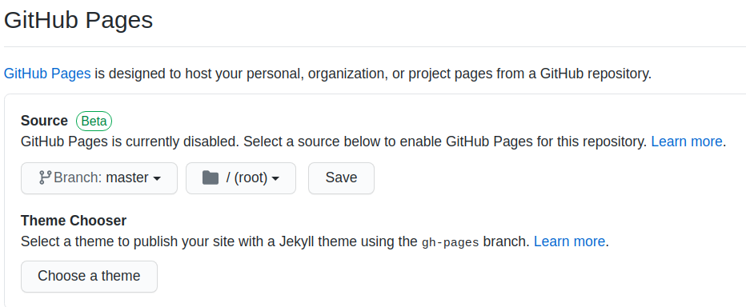

class: front


```{r eval=FALSE, include=FALSE}
# Para que funcione el infinite moon reader, correr desde el root!
```

```{r setup, include=FALSE, cache = FALSE}
require("knitr")
options(htmltools.dir.version = FALSE)
pacman::p_load(RefManageR)
# bib <- ReadBib("../../bib/electivomultinivel.bib", check = FALSE)
opts_chunk$set(warning=FALSE,
             message=FALSE,
             echo=TRUE,
             cache = TRUE,fig.width=7, fig.height=5.2)
```

<!---
Para correr en ATOM
- open terminal, abrir R (simplemente, R y enter)
- rmarkdown::render('static/docpres/07_interacciones/7interacciones.Rmd', 'xaringan::moon_reader')

About macros.js: permite escalar las imágenes como [scale 50%](path to image), hay si que grabar ese archivo js en el directorio.
--->


.pull-left[
# Ciencia Social Abierta
## cienciasocialabierta.netlify.app
----
## Juan Carlos Castillo
## Sociología FACSO - UChile
## 1er Sem 2020
]


.pull-right[
.right[

]

## Sesión 11: *Páginas Github*
]

---

layout: true
class: animated, fadeIn

---


---
.pull-left[
# Publicación web con base RMarkdown

- [Rmarkdown (web)](https://bookdown.org/yihui/rmarkdown/websites.html)

- [Blogdown (hugo)](https://bookdown.org/yihui/blogdown/)

- [Bookdown](https://bookdown.org/yihui/bookdown/)
]

.pull-right[


 Yihui Xie
]

---
class: roja

## Esta sesión 


# RMarkdown Websites

# Publicación en Github


---
class: inverse middle right


# Rmarkdown Websites


---
# Ejemplo

- [https://juancarloscastillo.github.io/merit-scale/index.html](https://juancarloscastillo.github.io/merit-scale/index.html))


---
# Transformar proyecto a sitio web

.pull-left[
- RStudio / Knitr permiten generar el sitio basados en [Jekyll](https://jekyllrb.com/) (no es necesario manejarlo para generar el sitio)

- Es una forma simple y rápida de generar y publicar páginas, sin grandes opciones de estructura.

]

--

.pull-right[
## Pasos

1. Creación de archivos básicos

2. Adaptación del sitio

3. Generación del sitio]

---
# 1. Creación de archivos básicos.

Son dos:

- index.html

- _site.yml


---
# 1. Creación de archivos básicos.

## index.html

- Es la página inicial del sitio

- Para generarlo, simplemente crear un archivo index.Rmd con la información que se desee mostar al inicio del sitio (se puede modificar luego)

---
# 1. Creación de archivos básicos

.pull-left-narrow[

## _site.yml: 
- estructura del sitio
]

.pull-right-wide[


]
---
# 2. Adaptación del sitio

- configurar:

  - Nombre del sitio
  
  - Barra de navegación (navbar)

---
# 2. Adaptación del sitio

- Pensando en un proyecto basado en protocolo IPO donde nos interesa publicar nuestro archivo _paper_, entonces:

```
name: "Nombre"
output_dir: "."
navbar:
  title: "Ejemplo WEB"
  left:
  - text: "Paper"
    href: paper.html

```

---
# 2. Adaptación del sitio

- Opciones adicionales: 

  - incluir más páginas html 
  
  - añadir íconos/links en la barra mediante [fonts-awesome](https://fontawesome.com/)
  
  - cambiar el tema general del sitio (theme)
  
  - cambios más específicos de formatos mediante css

---


---
.medium[
```
name: "Mi Nombre"
output_dir: "."
navbar:
  title: "Ejemplo WEB"
  left:
  - text: "Paper"
    href: paper.html
  right:
  - icon: fa-envelope fa-lg
    href: (aquí correo)
  - icon: fa-github fa-lg
    href: http://repositorio-del-sitio
output:
  html_document:
    theme: cerulean # yeti  spacelab simplex sandstone cosmo cerulean paper darkly flatly lumen readable
    css: 'styles.css'
```]

---
# 3. Generación del sitio

- la inclusión de los archivos index.html y _site.yml permite generar el sitio web

- el comando es `rmarkdown::render_site()`

- también puede ser con el botón Build Website en Rstudio:

 

(para que aparezca hay que reiniciar RStudio)

---
# 3. Generación del sitio

- La generación del sitio se basa en las instrucciones y archivos que están en la carpeta `site_libs`, que aparece en nuestro directorio.

- **NO BORRAR**


---
class: inverse, middle right


# Publicación en Github


---
# Pasos

- Actualizar el repositorio con el sitio ya generado localmente (commit - push)

- Ir a sección _Settings_ del repositorio -> Github pages: activar 


---
# Notas Github pages

- Theme chooser: se puede también elegir alguno de los temas por defecto desde aquí.

- Se recomienda luego hacer un link al sitio web desde el Readme.md

---
class: inverse

## Resumen

- Archivos básicos para generar sitio: index.Rmd/index.html, _site.yml

- Configuración de _site.yml

- Renderizar local, subir cambios a repositorio

- En Github Settings - > Gihub pages

---
class: front


.pull-left[
# Ciencia Social Abierta
## cienciasocialabierta.netlify.com
----
## Juan Carlos Castillo
## Sociología FACSO - UChile
## 1er Sem 2020
]


.pull-right[
.right[

]


]
