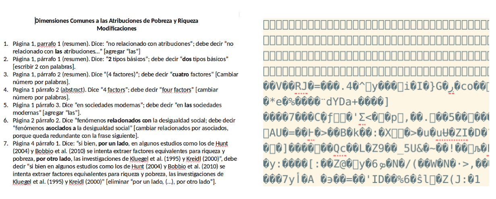

class: front

```{r eval=FALSE, include=FALSE}
# Para que funcione el infinite moon reader, correr desde el root!
```

```{r setup, include=FALSE, cache = FALSE}
require("knitr")
options(htmltools.dir.version = FALSE)
pacman::p_load(RefManageR)
# bib <- ReadBib("../../bib/electivomultinivel.bib", check = FALSE)
opts_chunk$set(warning=FALSE,
             message=FALSE,
             echo=TRUE,
             cache = TRUE,fig.width=7, fig.height=5.2)
```

<!---
Para correr en ATOM
- open terminal, abrir R (simplemente, R y enter)
- rmarkdown::render('static/docpres/07_interacciones/7interacciones.Rmd', 'xaringan::moon_reader')

About macros.js: permite escalar las imágenes como [scale 50%](path to image), hay si que grabar ese archivo js en el directorio.
--->


.pull-left[
# Ciencia Social Abierta
## cienciasocialabierta.netlify.app
----
## Juan Carlos Castillo
## Sociología FACSO - UChile
## 1er Sem 2020
]


.pull-right[
.right[

]


## Sesión 3: *Escritura en texto simple*
]

---

layout: true
class: animated, fadeIn

---
class: roja, right, bottom

# Resumen sesion anterior

---
class: inverse
## Resumen (I)

- Crisis de acceso <-> crisis de reproducibilidad

--

- Publica (alto impacto) o perece -> fomento de la irreproducibilidad

--

- Escasa publicación de estudios con resultados nulos

--

- Dilemas de eficiencia y éticos

---
class: inverse
## Resumen (II): Enfrentando la crisis de ciencia abierta (acceso y reproducibilidad)

- Escritura abierta (texto simple/plano)

--

- Repositorio con datos y código de análisis abierto

--

- Flujo de trabajo documentado y reproducible

--

- Control de versiones

--

- Publicación abierta y oportuna


---
class: roja, right, bottom,slideInRight

# Esta sesión:

## * Fundamentos escritura simple

## * Markdown

---
class: inverse, bottom, right

# Fundamentos de escritura simple

---
## Flujo de trabajo con procesador de texto tradicional

.center[

]

---
# Abriendo el archivo de escritura tradicional




---
# Desventajas del procesador tradicional para ciencia abierta

- Barrera de pago/licencia para acceder a contenidos

- No permite un documento enteramente reproducible que combine texto y código de análisis

- Difícil versionamiento y llevar registro de quién hizo qué cambio, barrera a la reproducibilidad y colaboración

---
# Escritura libre y abierta

- independiente de programa comercial

- independiente de plataformas específicas

- que permita combinar texto y análisis en un mismo documento

- foco en los contenidos en lugar del formato

- que permita distintas opciones de formato final

---
# Inspiración

.center[
]

---
# Principales Alternativas

<br>


|          	| **Control de formato** 	| **Marcas de edición** 	| **Formatos de salida** 	|
|----------	|:--------------------:|:----------------:|:--------------------:|
| LaTeX    	|          +         	|        +       	|          -         	|
| Markdown 	|          -         	|        -       	|          +         	|


---
class: inverse, bottom, right, slideInRight

# Markdown

---

# Markdown

- Literalmente: pocas marcas de edición

--

- No es un programa, es una forma de escritura

--

- Fácil escritura y conversión a otros formatos de salida (html, pdf)

--

- Soporta encabezados, tablas, imágenes, tablas de contenidos, ecuaciones, links ... todo lo necesario para documentos académicos

--

- filosofía: foco en contenido primero, el formato después.

---
# Ejemplos de marcas de edición en Markdown


  - Texto en **negrita** entre dos astericos: ``` **negrita** ```

  - Texto en *cursiva* con un asterico por lado: ``` *cursiva* ```
  
  - Títulos se marcan con # al principio, subtítulos ## , y así sucesivamente
  
  
- Mayores detalles en la Práctica de Markdown (ver sitio web del curso)


---
# Markdown y pandoc


---
class: inverse, slideInRight

## Resumen

- escritura cerrada en procesadores tradicionales

- escritura simple es escritura abierta

- formato de documentos simples mediante marcas de edición

- lenguaje de escritura simple propuesto: Markdown

- marcas de edición en Markdown luego son transformadas a formatos publicables vía PANDOC

---
class: roja, middle, center,slideInRight

# Próxima clase: 
# Rmarkdown y documentos dinámicos


---
class: front


.pull-left[
# Ciencia Social Abierta
## cienciasocialabierta.netlify.com
----
## Juan Carlos Castillo
## Sociología FACSO - UChile
## 1er Sem 2020
]


.pull-right[
.right[

]


]
