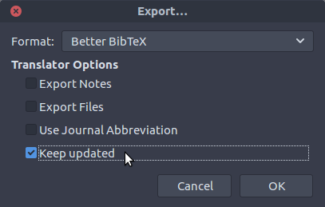
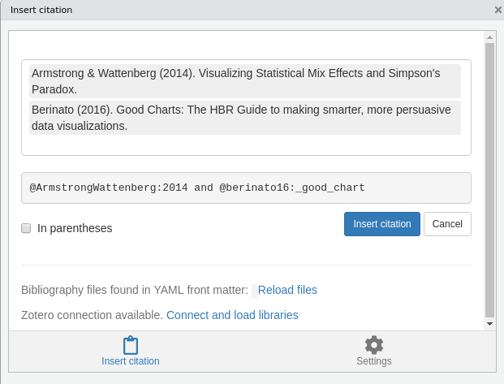

class: front

```{r eval=FALSE, include=FALSE}
# Para que funcione el infinite moon reader, correr desde el root!
```

```{r setup, include=FALSE, cache = FALSE}
require("knitr")
options(htmltools.dir.version = FALSE)
pacman::p_load(RefManageR)
# bib <- ReadBib("../../bib/electivomultinivel.bib", check = FALSE)
opts_chunk$set(warning=FALSE,
             message=FALSE,
             echo=TRUE,
             cache = TRUE,fig.width=7, fig.height=5.2)
```

<!---
Para correr en ATOM
- open terminal, abrir R (simplemente, R y enter)
- rmarkdown::render('static/docpres/07_interacciones/7interacciones.Rmd', 'xaringan::moon_reader')

About macros.js: permite escalar las imágenes como [scale 50%](path to image), hay si que grabar ese archivo js en el directorio.
--->


.pull-left[
# Ciencia Social Abierta
## cienciasocialabierta.netlify.app
----
## Juan Carlos Castillo
## Sociología FACSO - UChile
## 1er Sem 2020
]


.pull-right[
.right[

]


## Sesión 5: *Citando en texto plano*
]

---

layout: true
class: animated, fadeIn

---
class: inverse

## Sesión anterior

- RMarkdown: concepto y opciones

.pull-right[
.right[
## Esta sesión
1) Citando en texto plano

2) Automatización de citaciones

]]
---
class: inverse, bottom, right

# Repaso texto plano y RMarkdown

---
# Funcionamiento ([Healey](https://plain-text.co/))


---
# Funcionamiento

1. Artículo `RMarkdown` (.Rmd) combina texto plano Markdown y código de análisis `R`

2. `Knitr` (_cniter_ o _kaniter_) genera un archivo Markdown (.md) a partir del Rmd

3. El archivo Markdown puede ser transformado por `pandoc` a diferentes formatos de salida publicable

.small[Nota: `pandoc` se instala automáticamente con RStudio, no requiere instalación aparte]


---
# Escritura en RMarkdown

- permite incluir **trozos de código (chunks)**  en el texto

- un chunk se especifica mediante una línea de código inicial ` ```{r}`, y se cierra con ` ``` `

`Aquí texto `

````
```{r}`r ''`
1 + 1
```
````
`Aquí sigue el texto`

---
# Insertar chunks

Se pueden insertar rápidamente de la siguiente manera:

- Menú en ventana de RStudio *Insert* > R 

- o, combinación Ctrl + Alt + i

---
# Opciones (principales) de chunks

1. Mostrar código y resultado

2. Mostrar solo el código

3. Mostrar solo el resultado

4. No mostrar ni código ni resultado

5. Mostrar código sin ejecutarlo

6. Entregar resultado en formato directo (ej: html o latex)

---
class: roja right bottom


# Citando en texto plano

## 1 - Insertar & renderizar

## 2 - Automatizar

---
.pull-left[

]

.pull-right[
## Citar: Sobre hombros de gigantes

- pararse sobre el conocimiento acumulado

- identificar áreas para avanzar

- reconocer trabajo previo

- no reinventar la rueda

]
---
class: inverse, bottom, right

# 1- Insertar y renderizar

---
# Incorporación de citas en texto plano

Se requieren 2 insumos básicos: 

A - Archivo que almacena las referencias (.bib)

B - Archivo con información del estilo de citación (.csl)

---
# A. Archivo con referencias (.bib)

- Se utiliza una forma de almacenamiento de citas en texto plano llamada Bibtex

- Un archivo Bibtex tiene extensión .bib, donde deben estar almacenadas todas las referencias citadas en el texto

---
# A. Archivo con referencias (.bib)

Ejemplo de referencia en formato Bibtex:

.small[
```
@article{sabbagh_dimension_2003,
  title = {The Dimension of Social Solidarity in Distributive Justice},
  volume = {42},
  timestamp = {2014-09-26T12:30:41Z},
  number = {2},
  urldate = {2014-09-26},
  journal = {Social science information},
  author = {Sabbagh, Clara},
  year = {2003},
  pages = {255--276},
  file = {Snapshot:/storage/V5R7I29W/255.html:text/html},
  groups = {social justice theory,social justice theory}
}
```
]
---
# A. Archivo con referencias (.bib)

- un archivo bibtex tiene múltiples referencias una después de la otra, el orden no es relevante.

- cada referencia posee una serie de campos con información necesaria para poder citar

- este formato se puede ingresar manualmente, copiar y pegar de otras fuentes, o automatizar desde software de gestión de referencias (detalles más adelante)

---
# B. Archivo con definición de estilo (.csl)

- csl: citation style language

- existen múltiples estilos de citación (alrededor de 10.000)

- los más usados: APA, ASA, Chicago

- estos estilos se pueden bajar desde repositorios, se recomienda el siguiente: [https://www.zotero.org/styles](https://www.zotero.org/styles)

---
# Vinculando el archivo RMarkdown con los archivos de bibliografía


- se realiza en el preámbulo del documento (YAML), por ejemplo:


```
---
bibliography: referencias.bib
csl: apa.csl
---

 Y aquí comienza el documento ...

```

---
# Como citar

La forma de citar es a traves de la clave que identifica la referencia, que es la que aparece al principio de cada una, y se agrega una @. Ej:
.small[
```
- Tal como señala @sabbagh_dimension_2003, 
los principales resultados ...

```
]

Al renderizar, esto genera:

- Tal como señala Sabbagh (2003), los principales resultados ...

Y además, agrega la bibliografía al final del documento.

---
# Opciones de citación

- Autor en el texto y año entre paréntesis:  @sabbagh_dimension_2003

- Autor y año entre paréntesis: [@sabbagh_dimension_2003]

- Detalles: en ejercicio asociado a esta clase (página prácticas) 

---
class: inverse, right, bottom

# Automatizando la incorporación de referencias

## A. Almacenamiento y exportación

## B. Citación (en R/RStudio)

---
class: inverse, right, bottom

# Automatizando la incorporación de referencias

## **A. Almacenamiento y exportación**

## B. Citación (en R/RStudio)


---
# Bibtex

- es claro que la incorporación manual de citas en formato Bibtex es un gran desincentivo a su uso.

- la simplificación y automatización de esto pasa por dos procesos:

  - A. Almacentamiento y generación de referencias mediante software especializado
  
  - B. Incorporación de citas al documento
  
---
# Software de gestión de referencias

- los software de gestión de referencias bibliográficas permiten almacenar, organizar y luego utilizar las referencias

- diferentes alternativas de software de gestión de referencias bibliográficas: Endnote, Mendeley, Refworks, Zotero

- en adelante vamos a ejemplificar con Zotero, que es un software libre y de código abierto

---
## Zotero

- instalar  [https://www.zotero.org](zotero.org)

- además del programa, instalar "conector" para el navegador (permite almacenar directamente con 1 click) 

---
## Zotero: vista general

.center[

]

---
.pull-left[
# Zotero: almacenamiento
a) vía conector del navegador: cuando hay una referencia presente en la página, ir al botón del conector y se guarda (Zotero debe estar abierto)]

.pull-right[

]
---

.pull-left[
# Zotero: almacenamiento

b)Vía identificador DOI / ISBN / ISSN ]

.pull-right[

<br>
<br>
<br>
]

---
# Zotero: almacenamiento

.pull-left[
c) Manual: llenando los campos
]

.pull-right[

]
---
# Zotero

- más información sobre manejo y capacidades:

[https://www.youtube.com/watch?v=Uxv3aE4XoNY](https://www.youtube.com/watch?v=Uxv3aE4XoNY)

... y tutoriales y guías varios en la red

---
# Zotero-Bibtex

- Zotero permite exportar las referencias en formato Bibtex

- Puede ser toda la colección o una parte (carpeta)

- 2 alternativas: 
  - manual
  - automatizada
  
---
## Zotero-Bibtex: exportación manual

- Carpeta ->  boton derecho -> export -> formato Bibtex


- guardar archivo .bib en carpeta del documento RMarkdown

---
## Zotero-Bibtex: exportación automatizada

- Zotero plug-in BetterBibTex: permite tener la colección exportada sincronizada

- Instalación: 

  - bajar archivo desde el sitio del desarrollador: [https://retorque.re/zotero-better-bibtex/installation/](https://retorque.re/zotero-better-bibtex/installation/)

  - en Zotero: Tools -> Adds-on -> ruedita dentada -> install add-on from file
  
  - reiniciar Zotero
  
---
## Zotero-Bibtex: exportación automatizada (2)

.pull-left[

- Para exportar colección de manera sincronizada, seguir el mismo camino de exportación tradicional, pero 

  - en lugar de elegir formato Bibtex, elegir BetterBibTex
]  
.pull-right[
    - ... y seleccionar opción *keep updated*
  
]

---
class: inverse, right, bottom

# Automatizando la incorporación de referencias

## A. Almacenamiento y exportación

## **B. Citación (en R/RStudio)**

---
# Librería `citr`
.pull-left[
- install.packages("citr")

- (eventualmente reiniciar RStudio)

- menú desplegable Addins -> Insert Citations
]

.pull-right[

]

---
# Librería `citr`: selección y formato
.center[

]

---
class: inverse

## Resumen Citando en texto plano

### **1 - Insertar & renderizar**

- almacentamiento de referencias formato Bibtex en archivos .bib

- estilo definido en archivo csl

- opciones en preámbulo (YAML)

---
class: inverse

## Resumen Citando en texto plano

### **2 - Automatizar**

- Almacentamiento y exportación
  - Zotero
  - exportación (Bibtex o BetterBibTex)
  
- Citar: `citr` RStudio add-on


---
class: front


.pull-left[
# Ciencia Social Abierta
## cienciasocialabierta.netlify.com
----
## Juan Carlos Castillo
## Sociología FACSO - UChile
## 1er Sem 2020
]


.pull-right[
.right[

]


]
