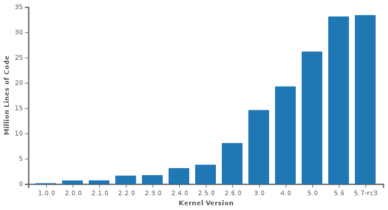
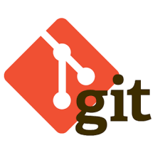
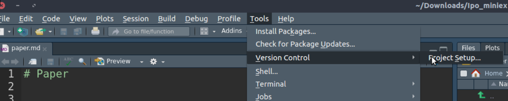
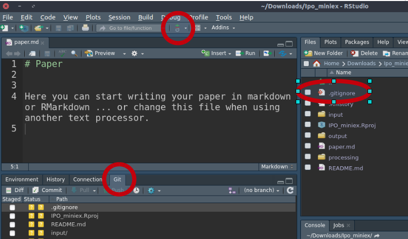
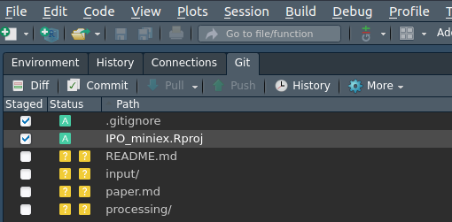
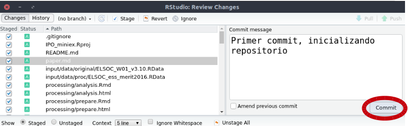
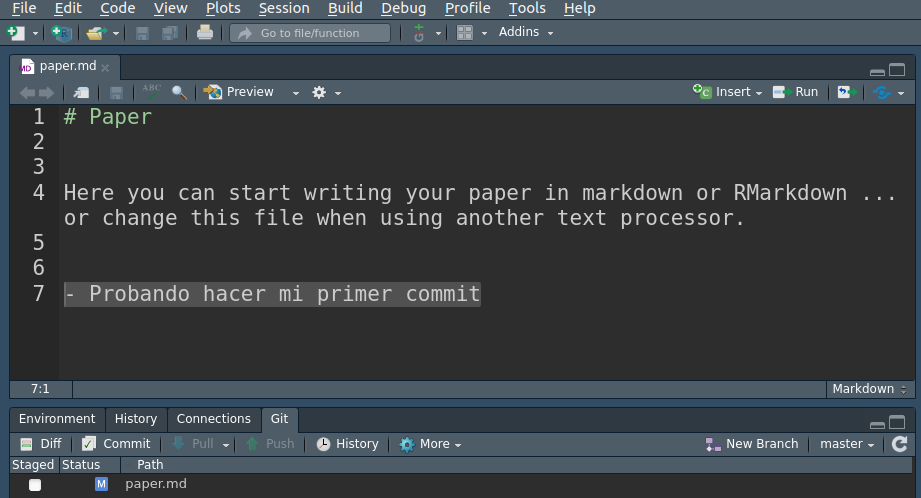
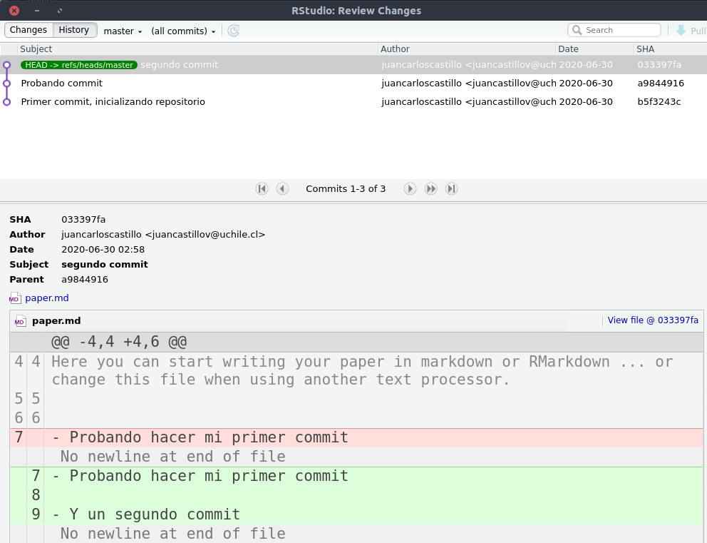

class: front

```{r eval=FALSE, include=FALSE}
# Para que funcione el infinite moon reader, correr desde el root!
```

```{r setup, include=FALSE, cache = FALSE}
require("knitr")
options(htmltools.dir.version = FALSE)
pacman::p_load(RefManageR)
# bib <- ReadBib("../../bib/electivomultinivel.bib", check = FALSE)
opts_chunk$set(warning=FALSE,
             message=FALSE,
             echo=TRUE,
             cache = TRUE,fig.width=7, fig.height=5.2)
```

<!---
Para correr en ATOM
- open terminal, abrir R (simplemente, R y enter)
- rmarkdown::render('static/docpres/07_interacciones/7interacciones.Rmd', 'xaringan::moon_reader')

About macros.js: permite escalar las imágenes como [scale 50%](path to image), hay si que grabar ese archivo js en el directorio.
--->


.pull-left[
# Ciencia Social Abierta
## cienciasocialabierta.netlify.app
----
## Juan Carlos Castillo
## Sociología FACSO - UChile
## 1er Sem 2020
]


.pull-right[
.right[

]

## Sesión 7: *Control de versiones & GIT*
]

---

layout: true
class: animated, fadeIn

---
class: inverse

## Sesión anterior: Protocolo reproducible

### - protocolos (mapa)

### - rutas relativas (caminos)

### - implementación: RStudio projects


---
# Protocolo IPO - Estructura de archivos y carpetas


---
# Rutas relativas

- forma de "señalar el camino" para abrir y guardar archivos al interior de una carpeta de proyecto autocontenido (= sin referencias locales)

- este camino tiene básicamente 3 direcciones:

  - bajar -> hacia subcarpetas (subcarpeta/subcarpeta)

  - subir -> hacia carpetas superiores (../ por cada nivel)

  - subir y bajar -> hacia otras subcarpetas

---
# RStudio Projects

.center[

]

---
class: roja, right, bottom

# Control de versiones & Git


---
.pull-left[
.center[

]
]

--

.pull-right[
<br>
<br>
<br>
#¿Cómo registrar de manera eficiente quién hizo qué y cuando en un archivo/documento?
]

---
## El origen: Abriendo un sistema operativo

.pull-right[

]

--

.pull-left[
- Linus Torvalds, 1991 (21 años)

- Crea sistema operativo libre (**Linux**) y lo abre a la colaboración. Postea:

  - "I'm doing a (free) operating system (just a hobby, won't be big and professional..."

]
---
## Desarrollo del Linux Kernel


.pull-left[

]

.pull-right[

- version 1: 1994

- version 5: 2019

- 5000 a 6000 colaboradores

- mas de 30 millones de líneas de código

- **versionamiento?**

]

---
#... más sobre Linux, Torvalds y código abierto


Linus Torvalds TED Talk (en inglés, pero con subtítulos ...)

[https://www.youtube.com/watch?v=o8NPllzkFhE&t=156s](https://www.youtube.com/watch?v=o8NPllzkFhE&t=156s)

---
# Git

.pull-left-narrow[

]

.pull-right-wide[
- Torvalds crea **Git** en 2005 para poder llevar registro y administrar las distintas versiones de Linux

- Git quiere decir *incompetente* / *desagradable*.

- "I'm an egotistical bastard, and I name all my projects after myself. First 'Linux', now 'git'." (Torvalds, 2012)

]


???

Torvalds sarcastically quipped about the name git (which means unpleasant person in British English slang): "I'm an egotistical bastard, and I name all my projects after myself. First 'Linux', now 'git'."[24][25] The man page describes Git as "the stupid content tracker".[26] The read-me file of the source code elaborates further:[27]

The name "git" was given by Linus Torvalds when he wrote the very first version. He described the tool as "the stupid content tracker" and the name as (depending on your way):

random three-letter combination that is pronounceable, and not actually used by any common UNIX command. The fact that it is a mispronunciation of "get" may or may not be relevant.
stupid. contemptible and despicable. simple. Take your pick from the dictionary of slang.
"global information tracker": you're in a good mood, and it actually works for you. Angels sing, and a light suddenly fills the room.
"goddamn idiotic truckload of sh*t": when it breaks

---
# Git: un software de control de versiones

- es una especie de memoria o registro local que guarda información sobre:

  - quién hizo un cambio
  - cuándo lo hizo
  - qué hizo

- mantiene la información de todos los cambios en la historia de la carpeta / repositorio local

- se puede sincronizar con repositorio remoto (ej. Github)

---
# Git

- actualmente, Git / Github posee más de 100 millones de repositorios

- mayor fuente de código en el mundo

- ha transitado desde el mundo de desarrollo de software hacia distintos ámbitos de trabajo colaborativo y abierto

- entorno de trabajo que favorece la ciencia abierta


---
.pull-left-narrow[
# Dos lógicas de versionamiento

1.*Deltas*


<br>
<br>


2.*Imágenes* (snapshots)

-> **Git**
]

.pull-right-wide[


]

---
class: middle right center

# Git no es un registro de versiones de archivos específicos, sino de una **carpeta completa**

<br>

# Guarda "fotos" de momentos específicos de la carpeta, y esta foto se *saca* mediante un **commit**

---
.center[

]

---
# Commits

- El **commit** es el procedimiento fundamental del control de versiones

- Git no registra cualquier cambio que se "guarda", sino los que se "comprometen" (commit).

- En un **commit**
  - se seleccionan los archivos cuyo cambio se desea registra (*stage*)
  - se describe lo que se está comprometiendo en el cambio (mensaje de commit)

---
# Pasos básicos

- inicializar la carpeta como repositorio git (solo la primera vez)

- agregar (add) los cambios que se quieran comprometer al escenario de compromiso (stage)

- mensaje de commit

- commit

---
# Uso

- tradicionalmente, el uso de git se realiza con comandos desde el **terminal** (git bash)

- actualmente, existen una serie de programas locales que facilitan el uso de Git

- en este curso, vamos a utilizar las utilidades Git / Github que se ofrecen en el contexto de **RStudio**

---
class: roja, right bottom

# Usando Git en RStudio

---
# RStudio: Git

- tiene integradas una serie de funciones que le permiten operar como _cliente_ Git

- Ventajas:
  - permanecer en R / RStudio

- Desventajas:
  - funciones e interfaz no son óptimas ... pero de todas maneras sirve

---
# RStudio: Git

- Para inicializar repositorio Git



- Version control system -> project setup -> **Git**

- Confirm restart


---
# RStudio: Git

.pull-left[
- también se puede hacer al momento de iniciar una carpeta como RProject (opción _create a git repository_)]

.pull-right[
.center[

]]

---
# RStudio: Git
.center[

]

---
# Rstudio - Git

- Botón Git

- Pestaña Git

- Archivos Git: para poder visualizarlos todos, en la ventana de archivos (Files) -> More -> Show hidden Files

- aparece una carpeta oculta `.git`, que es donde se almacena toda la información de las versiones.

---
# Commit inicial

.pull-left[

]

.pull-right[
- ir a la pestaña Git

- Marcar todos los archivos como _staged_

- botón commit

- escribir un mensaje de commit, y luego botón "commit"

]

---
# Commit inicial

.center[

]

- el momento y los archivos que incluyen los sucesivos commits queda a criterio del _master_ (dueñ_ del repo)

---
# Ejemplo: commit (en carpeta IPO miniex)

.center[

]

---
# Ejemplo: commit

- cuando un archivo se guarda, aparece listado en la pestaña Git, donde se registran todos los cambios desde el último commit

- luego se marca con un tick "staged" para todos los archivos que van a ser parte del commit

- botón commit + mensaje de commit + hacer commit

---
# Ejemplo: commit

.center[

]

---
# Revisión de versiones anteriores 


- Boton *history*

- abre ventana donde aparece el listado de commits

- en la ventana se puede navegar entre commits y los archivos de cada commit

- cambios de versiones anteriores en verde

---
.pull-left-narrow[
# Revisión de versiones anteriores]
.pull-right-wide[
.center[

]
]
---
# Notas

- los cambios en verde se muestran por línea completa de código, no por caracteres (al menos en RStudio)

- si se quiere volver a una versión anterior de algún archivo, entonces ir a view file @[número de commit], y se puede guardar/reemplazar en archivo actual

---
# Recomendaciones

- no hacer commit luego de cualquier cambio que no sea **relevante**

- ... pero, hacer commits **periódicamente**, sin que se junten muchos archivos  (ayuda a visualizar mejor los cambios)

- buenos **mensajes** de commits, breves e informativos

---
# Sobre Git y Github

- El uso de Git para archivos locales es útil, pero compite con otros sistemas de versionamiento local individual/remoto (Dropbox, Drive)

- El mayor sentido de usar Git es para
  - trabajo colaborativo
  - repositorios públicos
  
- Conocer Git otorga las bases para utilizar repositorios públicos como **Github**, que faciltan la reproducibilidad, colaboración, apertura y publicación de resultados. 

---
class: inverse

## Resumen

- Desarrollo de software abierto y necesidad de control de versiones en entorno colaborativo

- Versionamiento: favorece reproducibilidad y colaboración

- Git / RStudio

- Inicialización de repositorio Git

- Commits
---
class: roja, middle, center

.pull-left-wide[

]
## Próxima clase

# Github

---
class: front


.pull-left[
# Ciencia Social Abierta
## cienciasocialabierta.netlify.com
----
## Juan Carlos Castillo
## Sociología FACSO - UChile
## 1er Sem 2020
]


.pull-right[
.right[

]


]
